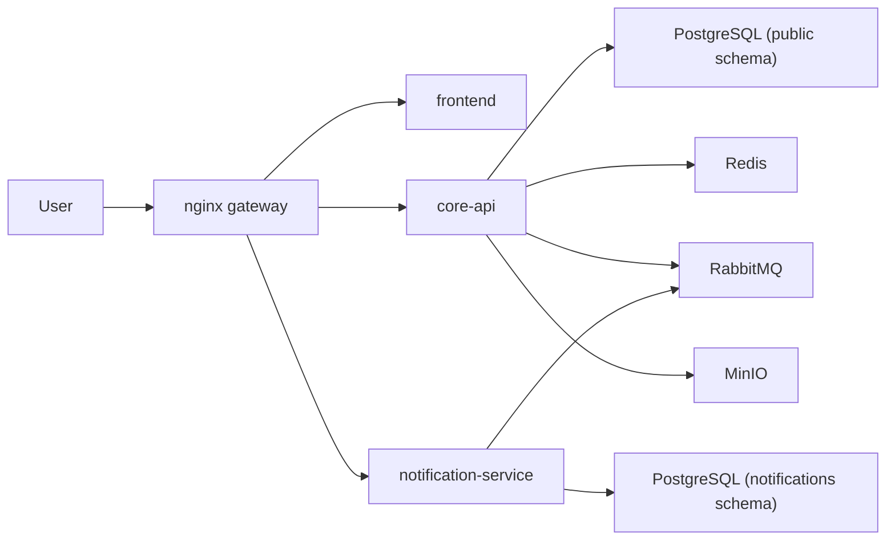

# CampusCore

[](https://github.com/JasonTM17/CampusCore_FullStack_Individual/actions/workflows/ci.yml)
[](https://github.com/JasonTM17/CampusCore_FullStack_Individual/actions/workflows/cd.yml)


CampusCore is an academic management platform built as **Microservices Portfolio v1**. The current runtime has a dedicated `core-api` for auth and academic domains, plus an independent `notification-service` for inbox ownership and realtime delivery. Public traffic goes through `nginx`, while PostgreSQL, Redis, RabbitMQ, and MinIO remain shared infrastructure services.

## Languages

- [Tiếng Việt](./README.vi.md)
- [English](./README.en.md)

## Current architecture

CampusCore currently ships three deployable applications:

- `frontend`: Next.js 15 using the standalone runtime
- `core-api`: NestJS 11 owning auth, users, announcements, enrollments, finance, grades, schedules, analytics, and public health
- `notification-service`: NestJS 11 owning notification inboxes, the `/notifications` websocket namespace, RabbitMQ consumption, and notification health probes



## Public contract

| URL                                        | Purpose                                                  |
| ------------------------------------------ | -------------------------------------------------------- |
| `http://localhost`                         | Public entrypoint through nginx                          |
| `http://localhost/login`                   | Login page                                               |
| `http://localhost/health`                  | Public liveness from `core-api`                          |
| `http://localhost/api/docs`                | Swagger through nginx                                    |
| `http://localhost/api/v1/notifications/*`  | Public notifications API owned by `notification-service` |
| `http://localhost/socket.io/*`             | Public Socket.IO route owned by `notification-service`   |
| `http://localhost/api/v1/health/readiness` | Blocked on the public edge                               |

## Auth model

Browser traffic uses:

- `cc_access_token`
- `cc_refresh_token`
- `cc_csrf`
- `X-CSRF-Token` for mutating requests

Legacy clients are still supported through JSON `accessToken`, `refreshToken`, `user`, and Bearer authentication.

## Health model

- `GET /health`: minimal public liveness from `core-api`
- `GET /api/v1/health/readiness`: internal readiness for `core-api`
- `GET /api/v1/health/liveness`: per-service internal liveness
- `notification-service` exposes its own readiness and liveness, but nginx does not publish them on the public edge

## Quick start

### Local full stack

```bash
cp .env.example .env
docker compose up -d --build
```

The dev compose stack boots in this order:

1. `postgres`, `redis`, `rabbitmq`, `minio`
2. `core-api-init` to push the `public` schema and seed deterministic data
3. `notification-service-init` to push the `notifications` schema and copy legacy notifications once when the old table exists
4. `core-api`, `notification-service`, `frontend`, `nginx`

### Production-like stack

```bash
export DOCKERHUB_NAMESPACE=<namespace>
export IMAGE_TAG=v1.0.0
docker compose -f docker-compose.production.yml --profile bootstrap run --rm core-api-init
docker compose -f docker-compose.production.yml --profile bootstrap run --rm notification-service-init
docker compose -f docker-compose.production.yml up -d
```

Production compose keeps runtime images clean. Schema bootstrap must be run before the first deployment as documented in [docs/OPERATIONS.md](./docs/OPERATIONS.md).

## Verification matrix

CampusCore is gated by these lanes:

- `core-quality`
- `core-integration`
- `notification-quality`
- `notification-integration`
- `frontend-quality`
- `frontend-fast-e2e`
- `compose-contract`
- `image-smoke`
- `edge-e2e`
- `security-scan`
- `dependency-review`
- `quality-gate`

### Local verification

- `cd backend && npm run lint && npm run lint:format && npm run typecheck && npm run build && npm run test:unit -- --runInBand && npm run test:integration -- --runInBand`
- `cd notification-service && npm run lint && npm run lint:format && npm run typecheck && npm run build && npm run test:unit -- --runInBand && npm run test:integration -- --runInBand`
- `cd frontend && npm run lint && npm run typecheck && npm test && npm run build && npm run test:e2e`
- `node scripts/run-image-smoke.mjs`
- `cd frontend && npm run test:e2e:edge`
- `node scripts/run-security-local.mjs`
- `docker compose -f docker-compose.yml config`
- `docker compose -f docker-compose.production.yml config`
- `docker compose -f docker-compose.e2e.yml config`
- `git diff --check`

## Release policy

- Public registries publish only from semver tags `vX.Y.Z`
- `master` and `main` run CI only and do not publish public releases
- Each release publishes all three images:
  - `campuscore-backend`
  - `campuscore-notification-service`
  - `campuscore-frontend`
- Release tags always include:
  - the semver tag, such as `v1.0.0`
  - an immutable short SHA
  - `latest`, updated only together with a semver release

## Registry

### Docker Hub

- `nguyenson1710/campuscore-backend`
- `nguyenson1710/campuscore-notification-service`
- `nguyenson1710/campuscore-frontend`

### GitHub Container Registry

- `ghcr.io/jasontm17/campuscore-backend`
- `ghcr.io/jasontm17/campuscore-notification-service`
- `ghcr.io/jasontm17/campuscore-frontend`

## Additional docs

- [Vietnamese README](./README.vi.md)
- [Architecture](./docs/ARCHITECTURE.md)
- [Operations](./docs/OPERATIONS.md)
- [Security](./docs/SECURITY.md)
- [Release](./docs/RELEASE.md)
- [Docker Hub Guide](./DOCKER_HUB.md)

## Author

Nguyễn Tiến Sơn

- GitHub: [JasonTM17](https://github.com/JasonTM17)
- Email: [jasonbmt06@gmail.com](mailto:jasonbmt06@gmail.com)
