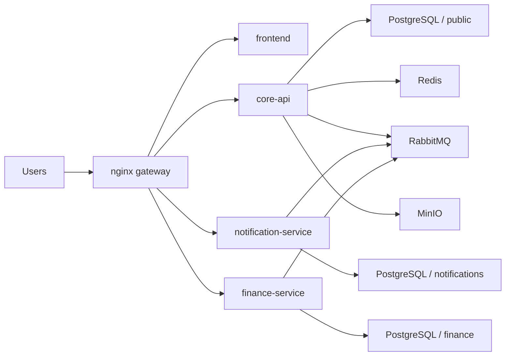

# CampusCore

[](https://github.com/JasonTM17/CampusCore_FullStack_Individual/actions/workflows/ci.yml)
[](https://github.com/JasonTM17/CampusCore_FullStack_Individual/actions/workflows/cd.yml)


CampusCore is an academic management platform built as **Microservices Portfolio v2**. The current system keeps `core-api` as the system of record for auth and academic data, runs a dedicated `notification-service` for notification inbox ownership and realtime delivery, adds a dedicated `finance-service` for the finance domain, serves the user experience through `frontend`, and exposes everything publicly through a single `nginx gateway`.

The primary README is the Vietnamese version with full diacritics:

- [README.md](./README.md)
- [README.vi.md](./README.vi.md)

## Architecture overview

CampusCore currently ships four public deployable applications:

- `frontend`: Next.js 15 using the standalone runtime for production-like execution
- `core-api`: NestJS 11 owning auth, session, users, roles, permissions, students, semesters, enrollments, sections, grades, schedules, announcements, and public health
- `notification-service`: NestJS 11 owning notification inboxes, the `/notifications` websocket namespace, RabbitMQ consumption, and realtime fan-out
- `finance-service`: NestJS 11 owning invoices, invoice items, payments, scholarships, student scholarships, and finance event publishing

Shared infrastructure:

- `nginx` as the only public gateway
- PostgreSQL on one cluster with **service-specific schemas**
- Redis for caching and support services
- RabbitMQ for event-driven integration
- MinIO for the object storage deployment contract



## Domain ownership

| Component | Owns | Does not own |
| --- | --- | --- |
| `core-api` | auth, session, identity, users, roles, permissions, students, semesters, enrollments, sections, grades, schedules, announcements, public `/health` | notification inboxes, finance data |
| `notification-service` | notification inboxes, unread counts, `/notifications` websocket, event-driven realtime and inbox persistence | auth source of truth, academic data, finance tables |
| `finance-service` | invoices, invoice items, payments, scholarships, student scholarships, finance event publishing | users, semesters, enrollments source of truth |

## Public contract

All public traffic goes through `nginx`. The frontend keeps the same public API paths while service ownership changes behind the gateway.

| URL | Purpose | Gateway target |
| --- | --- | --- |
| `http://localhost/` | Web application | `frontend` |
| `http://localhost/login` | Login screen | `frontend` |
| `http://localhost/health` | Minimal public liveness | `core-api` |
| `http://localhost/api/docs` | Public Swagger | `core-api` |
| `http://localhost/api/v1/notifications/*` | Notifications API | `notification-service` |
| `http://localhost/socket.io/*` | Realtime gateway | `notification-service` |
| `http://localhost/api/v1/finance/*` | Finance API | `finance-service` |

The following paths are **not public** through `nginx`:

- `GET /api/v1/health/readiness`
- `GET /api/v1/health/liveness`
- `GET /internal/v1/finance-context/students/:studentId`
- `GET /internal/v1/finance-context/semesters/:semesterId`
- `GET /internal/v1/finance-context/semesters/:semesterId/billable-students`

## Auth and session model

Browser traffic uses one shared contract across services:

- `cc_access_token`
- `cc_refresh_token`
- `cc_csrf`
- `X-CSRF-Token` for mutating requests authenticated by cookies

Legacy compatibility remains available through:

- JSON `accessToken`, `refreshToken`, `user`
- `Authorization: Bearer ...`

Token extraction order:

1. Bearer token
2. `cc_access_token` cookie

## Data model and service boundaries

CampusCore uses a **per-service schema strategy on a shared PostgreSQL cluster**:

- `core-api` uses `schema=public`
- `notification-service` uses `schema=notifications`
- `finance-service` uses `schema=finance`

No service should perform runtime joins directly across another service schema on its primary request path. Finance uses **internal HTTP read-through** from `finance-service` to `core-api`, guarded by `X-Service-Token`, only to:

- validate `studentId`
- validate `semesterId`
- fetch billable students for semester invoice generation
- fetch display snapshots to freeze onto invoices

`finance-service` stores these display snapshots on each invoice:

- `studentDisplayName`
- `studentEmail`
- `studentCode`
- `semesterName`

## Event flow

The shared event envelope contains:

- `type`
- `source`
- `occurredAt`
- `payload`

Important v2 flows:

- `core-api` publishes `announcement.created`
- `core-api` may publish `notification.user.created` and `notification.role.created`
- `finance-service` publishes:
  - `invoice.created`
  - `invoice.status.changed`
  - `payment.completed`
- `notification-service` consumes these events to create inbox notifications or broadcast realtime billing updates

## Quick start

### Local full stack

```bash
cp .env.example .env
docker compose up -d --build
```

The development stack boots in this order:

1. `postgres`, `redis`, `rabbitmq`, `minio`
2. `core-api-init` to push the `public` schema and seed data
3. `notification-service-init` to push the `notifications` schema and migrate legacy notifications
4. `finance-service-init` to push the `finance` schema and migrate legacy finance data
5. `core-api`, `notification-service`, `finance-service`, `frontend`, `nginx`

### Production-like stack

```bash
export DOCKERHUB_NAMESPACE=<namespace>
export IMAGE_TAG=v1.0.0
docker compose -f docker-compose.production.yml --profile bootstrap run --rm core-api-init
docker compose -f docker-compose.production.yml --profile bootstrap run --rm notification-service-init
docker compose -f docker-compose.production.yml --profile bootstrap run --rm finance-service-init
docker compose -f docker-compose.production.yml up -d
```

Production compose keeps runtime containers clean. Schema bootstrap is an operational prerequisite before the first deployment.

## Portfolio verification

A full verification pass should cover all four applications:

- `backend/core-api`: lint, format, typecheck, build, unit tests, integration tests
- `notification-service`: lint, format, typecheck, build, unit tests, integration tests
- `finance-service`: lint, format, typecheck, build, unit tests, integration tests
- `frontend`: lint, typecheck, tests, build, fast E2E
- runtime stack: image smoke, edge E2E, compose contract, security sweep

Reference local verification:

- `cd backend && npm run lint && npm run lint:format && npm run typecheck && npm run build && npm run test:unit -- --runInBand && npm run test:integration -- --runInBand`
- `cd notification-service && npm run lint && npm run lint:format && npm run typecheck && npm run build && npm run test:unit -- --runInBand && npm run test:integration -- --runInBand`
- `cd finance-service && npm run lint && npm run lint:format && npm run typecheck && npm run build && npm run test:unit -- --runInBand && npm run test:integration -- --runInBand`
- `cd frontend && npm run lint && npm run typecheck && npm test && npm run build && npm run test:e2e`
- `node scripts/run-image-smoke.mjs`
- `cd frontend && npm run test:e2e:edge`
- `node scripts/run-security-local.mjs`
- `docker compose -f docker-compose.yml config`
- `docker compose -f docker-compose.production.yml config`
- `docker compose -f docker-compose.e2e.yml config`
- `git diff --check`

## Release policy

CampusCore uses a **semver-only public release** policy:

- public registries publish only when a `vX.Y.Z` tag is pushed
- `master` or `main` runs CI only
- `latest` only moves together with a semver release
- each public release must publish all four images:
  - `campuscore-backend`
  - `campuscore-notification-service`
  - `campuscore-finance-service`
  - `campuscore-frontend`

## Registry

### Docker Hub

- `nguyenson1710/campuscore-backend`
- `nguyenson1710/campuscore-notification-service`
- `nguyenson1710/campuscore-finance-service`
- `nguyenson1710/campuscore-frontend`

### GitHub Container Registry

- `ghcr.io/jasontm17/campuscore-backend`
- `ghcr.io/jasontm17/campuscore-notification-service`
- `ghcr.io/jasontm17/campuscore-finance-service`
- `ghcr.io/jasontm17/campuscore-frontend`

## Additional documentation

- [README.md](./README.md)
- [README.vi.md](./README.vi.md)
- [docs/ARCHITECTURE.md](./docs/ARCHITECTURE.md)
- [docs/OPERATIONS.md](./docs/OPERATIONS.md)
- [docs/SECURITY.md](./docs/SECURITY.md)
- [docs/RELEASE.md](./docs/RELEASE.md)
- [DOCKER_HUB.md](./DOCKER_HUB.md)

## Author

Nguyễn Tiến Sơn

- GitHub: [JasonTM17](https://github.com/JasonTM17)
- Email: [jasonbmt06@gmail.com](mailto:jasonbmt06@gmail.com)
