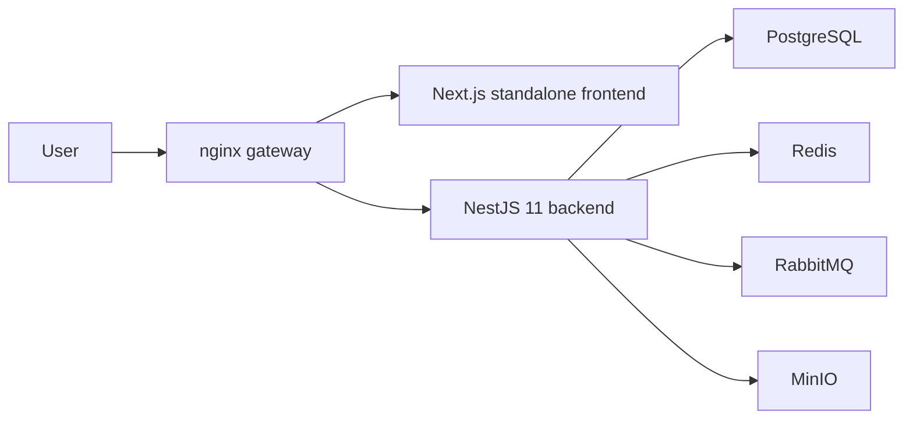

# CampusCore

[](https://github.com/JasonTM17/CampusCore_FullStack_Individual/actions/workflows/ci.yml)
[](https://github.com/JasonTM17/CampusCore_FullStack_Individual/actions/workflows/cd.yml)


CampusCore is an academic management platform for course registration, schedules, grades, tuition invoices, announcements, and administrative operations.

The repository keeps **one deployable NestJS 11 backend**, but verifies it as a **multi-service stack** with nginx, PostgreSQL, Redis, RabbitMQ, MinIO, image smoke, and focused end-to-end coverage. That keeps deployment simple while making runtime checks behave like a production environment.

## Languages

- [Tiếng Việt](./README.vi.md)
- [English](./README.en.md)

## Quick Summary

- Next.js 15 frontend runs with the standalone runtime in Docker
- Public traffic goes through nginx at `http://localhost`
- `GET /health` is the public liveness endpoint and stays minimal
- The canonical readiness endpoint is `GET /api/v1/health/readiness`
- Browser auth uses `HttpOnly` cookies plus CSRF protection
- Legacy clients still work with JSON token/Bearer flows during the transition period
- Public releases are published only from semver tags `vX.Y.Z`

## Real Runtime Shape

| URL | Purpose |
| --- | --- |
| `http://localhost` | Public entrypoint through nginx |
| `http://localhost/login` | Login page |
| `http://localhost/health` | Public liveness endpoint with a minimal payload |
| `http://localhost/api/docs` | Swagger UI through nginx |
| `http://localhost/api/v1/health/readiness` | Internal readiness, protected by `X-Health-Key` in production-like environments |
| `http://localhost:4000/api/v1/health/liveness` | Direct backend liveness in the local stack |

Inside Docker, the frontend listens on port `3000`, the backend listens on port `4000`, and nginx is the only public gateway in the runtime stack.



## Functional Areas

### Student

- Course registration
- Weekly schedule
- Grades and transcript views
- Tuition invoices
- Announcements
- Profile management

### Lecturer

- Teaching schedule
- Grade management
- Dashboard flows with safe empty states

### Admin

- User management
- Course and section administration
- Enrollment management
- Operational dashboards

## Current Auth Model

Browser sessions use these cookies:

- `cc_access_token`
- `cc_refresh_token`
- `cc_csrf`

Mutating browser requests send `X-CSRF-Token`. Legacy clients can still use JSON responses with `accessToken`, `refreshToken`, `user` and Bearer authorization so external integrations do not break during migration.

## Current Health Model

- `GET /health`: public liveness, minimal payload
- `GET /api/v1/health/readiness`: internal readiness, detailed payload
- `GET /api/v1/health`: temporary alias for readiness to preserve compatibility

Readiness reports the real status of `database`, `redis`, and `rabbitmq` as `up`, `down`, or `not_configured`.

## Container Images and Registry

### Docker Hub

- `nguyenson1710/campuscore-backend`
- `nguyenson1710/campuscore-frontend`

### GitHub Container Registry

- `ghcr.io/jasontm17/campuscore-backend`
- `ghcr.io/jasontm17/campuscore-frontend`

Tags follow the same release rule everywhere:

- `latest`
- semantic tags such as `v1.0.0`
- immutable SHA tags such as `0f8bc44`

Public release publishing is allowed only from semver tags `vX.Y.Z`. Branch pushes run CI only and do not publish public releases.

## Quick Start

### Local full stack

```bash
cp .env.example .env
docker compose up -d --build
```

Open:

- `http://localhost`
- `http://localhost/api/docs`
- `http://localhost/health`

### Production-like runtime

```bash
docker compose -f docker-compose.production.yml up -d
```

The production-like frontend uses the standalone runtime. It does not rely on `next start` as the primary runtime path.

## Verification

The repository is gated by:

- backend lint, format check, typecheck, build, unit tests, and integration tests
- frontend lint, typecheck, build, smoke tests, and E2E
- production-like image smoke from the real Dockerfiles
- edge E2E through nginx
- Docker compose contract checks for dev, prod, and E2E
- security scans for source and images

## CI/CD

GitHub Actions acts as both quality gate and release gate:

- `CI Build and Test` runs the full quality matrix, integration, E2E, image smoke, and security scanning
- `CD - Gated Registry Publish` publishes registry images only after the matching commit has cleared the quality gate and the ref is a semver tag `vX.Y.Z`

Release rules:

- `DOCKERHUB_NAMESPACE` is the preferred namespace input
- `DOCKERHUB_USERNAME` is kept as a legacy alias for compatibility
- `latest` updates only when a semver release is published
- rollback should use a digest or an immutable SHA tag

## Additional Docs

- [Vietnamese README](./README.vi.md)
- [Docker Hub Guide](./DOCKER_HUB.md)
- [Architecture](./docs/ARCHITECTURE.md)
- [Operations](./docs/OPERATIONS.md)
- [Security](./docs/SECURITY.md)
- [Release](./docs/RELEASE.md)

## Author

Nguyen Tien Son

- GitHub: [JasonTM17](https://github.com/JasonTM17)
- Email: [jasonbmt06@gmail.com](mailto:jasonbmt06@gmail.com)
