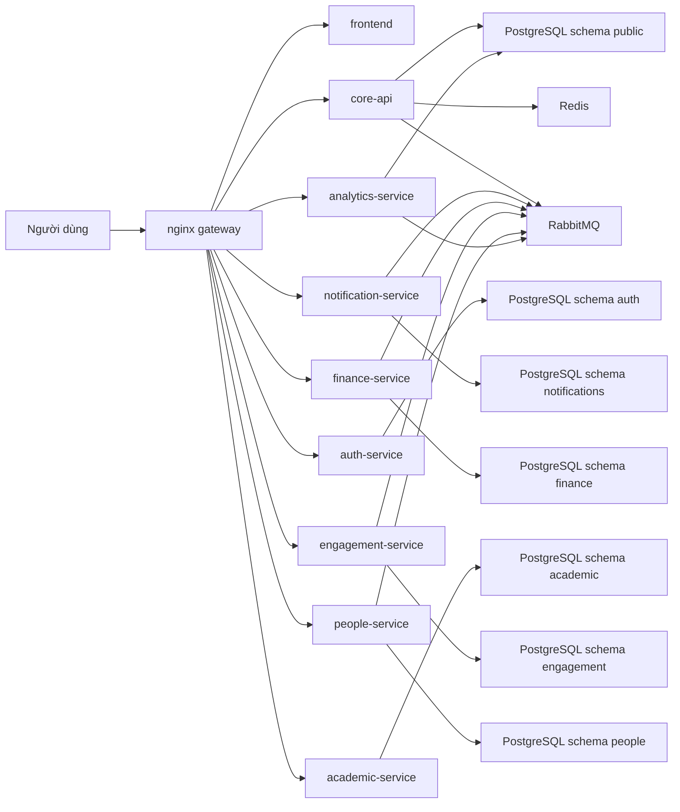

# CampusCore

[](https://github.com/JasonTM17/CampusCore_FullStack_Individual/actions/workflows/ci.yml)
[](https://github.com/JasonTM17/CampusCore_FullStack_Individual/actions/workflows/cd.yml?query=branch%3Av1.3.4)


CampusCore là một **microservices portfolio production-like** cho bài toán quản lý học vụ đại học. Ở trạng thái hiện tại, hệ thống chạy với `core-api` làm lõi platform, `auth-service` làm owner của auth/IAM, sáu domain service tách riêng là `notification-service`, `finance-service`, `academic-service`, `engagement-service`, `people-service`, `analytics-service`, một `frontend`, và một `nginx gateway` làm public edge duy nhất.

`README.md` là **bản chính bằng tiếng Việt có dấu**. Bản song ngữ đi kèm:

- [README.vi.md](./README.vi.md)
- [README.en.md](./README.en.md)

## Tổng quan hiện tại

- `core-api`: audit logs, finance-context, compatibility shadow, public health
- `auth-service`: auth, sessions, users, roles, permissions, JWT cookie + CSRF contract
- `notification-service`: notification inbox, unread count, websocket `/notifications`, realtime fan-out
- `finance-service`: invoices, invoice items, payments, scholarships, export và billing events
- `academic-service`: faculties, departments, academic years, semesters, courses, curricula, classrooms, sections, enrollments, grades, waitlist, attendance, schedules
- `engagement-service`: announcements, support tickets, workflows tương tác
- `people-service`: service công khai sở hữu `students` và `lecturers`
- `analytics-service`: service công khai sở hữu `/api/v1/analytics/*`
- `frontend`: Next.js 15, production-like runtime bằng standalone build
- `nginx`: gateway công khai duy nhất

Hạ tầng dùng chung:

- PostgreSQL theo mô hình **một cluster, nhiều schema theo service**
- Redis
- RabbitMQ
- MinIO

## Kiến trúc runtime



## Boundary dịch vụ

### `core-api`

`core-api` vẫn là lõi platform, nhưng không còn giữ quyền sở hữu công khai cho auth/IAM, `students`, `lecturers`, hay `analytics`. Trách nhiệm hiện tại:

- `/health`
- `/api/v1/health/readiness`
- internal contexts như `finance-context`
- audit logs và compatibility shadow trong một release chuyển tiếp

Contract cookie, CSRF, internal headers, và helper JWT dùng chung được khóa qua package nội bộ `packages/platform-auth`.

### `auth-service`

`auth-service` là service công khai sở hữu:

- `/api/v1/auth/*`
- `/api/v1/users/*`
- `/api/v1/roles/*`
- `/api/v1/permissions/*`

Service này dùng schema `auth`, phát JWT/session browser, giữ legacy Bearer compatibility, publish shadow IAM events cho `core-api`, và consume `people-shadow` để JWT claims `studentId` / `lecturerId` không bị gãy trong một release chuyển tiếp.

### `people-service`

`people-service` là service công khai sở hữu:

- `/api/v1/students/*`
- `/api/v1/lecturers/*`

Service này lưu dữ liệu ở schema `people` theo mô hình snapshot cục bộ. Trong một release chuyển tiếp, `core-api` vẫn giữ shadow `Student` và `Lecturer` để JWT claims `studentId` và `lecturerId` không bị gãy, đồng thời để `finance-context` cũ tiếp tục hoạt động ổn định.

### `analytics-service`

`analytics-service` là service công khai sở hữu:

- `/api/v1/analytics/*`

Analytics hiện giữ hướng low-risk: service này vẫn đọc từ dữ liệu legacy và shadow hiện có trong schema `public`, nhưng public edge đã cắt hẳn khỏi `core-api`.

### Các service domain còn lại

- `notification-service`: `/api/v1/notifications/*`, `/socket.io/*`
- `finance-service`: `/api/v1/finance/*`
- `academic-service`: public academic APIs
- `engagement-service`: announcements, support tickets, và các route tương tác

## Routing công khai

`nginx` là public edge duy nhất. Routing hiện tại được chốt như sau:

- `/` và các route ứng dụng web -> `frontend`
- `/health` -> `core-api`
- `/api/docs` -> `core-api`
- `/api/v1/auth/*`, `/api/v1/users/*`, `/api/v1/roles/*`, `/api/v1/permissions/*` -> `auth-service`
- `/api/v1/notifications/*`, `/socket.io/*` -> `notification-service`
- `/api/v1/finance/*` -> `finance-service`
- public academic routes -> `academic-service`
- `/api/v1/announcements/*`, `/api/v1/support-tickets/*` -> `engagement-service`
- `/api/v1/students/*`, `/api/v1/lecturers/*` -> `people-service`
- `/api/v1/analytics/*` -> `analytics-service`

Không public qua `nginx`:

- `/internal/*`
- `/api/v1/internal/*`
- readiness nội bộ của các service

## Auth và tương thích

Browser auth contract dùng thống nhất trên toàn stack:

- cookie `cc_access_token`
- cookie `cc_refresh_token`
- cookie `cc_csrf`
- header `X-CSRF-Token`

Các service backend đọc được cả:

1. `Authorization: Bearer ...`
2. cookie access token

Frontend không phải đổi path API khi các service được tách.

## Internal contracts

Canonical internal contract hiện tại là:

- `/api/v1/internal/academic-context/*`
- `/api/v1/internal/auth-context/*`
- `/api/v1/internal/finance-context/*`

Các route này chỉ dùng cho service-to-service và yêu cầu `X-Service-Token`. Public edge chặn toàn bộ các path này. Alias `/api/v1/internal/people-context/*` chỉ còn giữ tạm một release để tương thích nội bộ, không còn là contract canonical.

## Release và registry

CampusCore dùng chính sách **semver-only public release**:

- push vào `master` hoặc `main` chỉ chạy CI
- chỉ publish public registry khi push tag `vX.Y.Z`
- `latest` chỉ cập nhật cùng một semver release

Ở trạng thái hiện tại, release công khai phải có đủ **9 image**:

1. `campuscore-backend`
2. `campuscore-auth-service`
3. `campuscore-notification-service`
4. `campuscore-finance-service`
5. `campuscore-academic-service`
6. `campuscore-engagement-service`
7. `campuscore-people-service`
8. `campuscore-analytics-service`
9. `campuscore-frontend`

Chi tiết registry và tag strategy nằm tại [DOCKER_HUB.md](./DOCKER_HUB.md) và [docs/RELEASE.md](./docs/RELEASE.md).

## Kubernetes

Repo hiện có bộ manifest Kustomize tại [k8s/README.md](./k8s/README.md) cho cùng topology 9 image, với `k8s/base` + `k8s/bootstrap` làm canonical deploy target và `k8s/overlays/docker-desktop` làm đường local-first cho Docker Desktop Kubernetes. Runtime này giữ nguyên boundary service, public routing, và security contract đang dùng ở Docker Compose. Để verify nhanh có cleanup mặc định, dùng `node scripts/run-k8s-local-smoke.mjs`; để giữ nguyên resources cho Docker Desktop UI, dùng `node scripts/run-k8s-local-deploy.mjs` rồi chuyển namespace sang `campuscore`.

## Chạy nhanh cục bộ

```bash
cp .env.example .env
docker compose up -d --build
```

Workflow verify:

- fast UI/E2E: `node scripts/run-fast-e2e.mjs`
- edge E2E qua `nginx`: `node scripts/run-edge-e2e.mjs`
- image smoke: `node scripts/run-image-smoke.mjs`
- security local: `node scripts/run-security-local.mjs`

Trình tự bootstrap one-shot hiện tại:

1. `core-api-init`
2. `auth-service-init`
3. `notification-service-init`
4. `finance-service-init`
5. `academic-service-init`
6. `engagement-service-init`
7. `people-service-init`
8. `analytics-service-init`
9. runtime services

## Quality gate

Mỗi release semver chỉ hợp lệ khi toàn bộ quality lanes xanh trên cùng một SHA. Ở trạng thái hiện tại, các lane bắt buộc bao gồm tối thiểu:

- `core-quality`
- `core-integration`
- `auth-quality`
- `auth-integration`
- `notification-quality`
- `notification-integration`
- `finance-quality`
- `finance-integration`
- `academic-quality`
- `academic-integration`
- `engagement-quality`
- `engagement-integration`
- `people-quality`
- `people-integration`
- `analytics-quality`
- `analytics-integration`
- `frontend-quality`
- `frontend-fast-e2e`
- `compose-contract`
- `image-smoke`
- `edge-e2e`
- `security-scan`
- `dependency-review`
- `quality-gate`

## Tài liệu vận hành

- [README.vi.md](./README.vi.md)
- [README.en.md](./README.en.md)
- [docs/ARCHITECTURE.md](./docs/ARCHITECTURE.md)
- [docs/OPERATIONS.md](./docs/OPERATIONS.md)
- [docs/SECURITY.md](./docs/SECURITY.md)
- [docs/RELEASE.md](./docs/RELEASE.md)
- [DOCKER_HUB.md](./DOCKER_HUB.md)

## Ghi chú thực tế

- `people-service` đã là service công khai sở hữu `students` và `lecturers`.
- `analytics-service` đã là service công khai sở hữu `/api/v1/analytics/*`.
- `auth`, `users`, `roles`, `permissions` đã chuyển public owner sang `auth-service`.
- JWT hiện vẫn ổn định nhờ cơ chế **đồng bộ shadow trong một release chuyển tiếp** giữa `people-service`, `auth-service`, và `core-api`.
- Hệ thống là microservices thật ở mức runtime và release, nhưng vẫn dùng PostgreSQL cluster dùng chung với schema tách riêng cho từng service.
