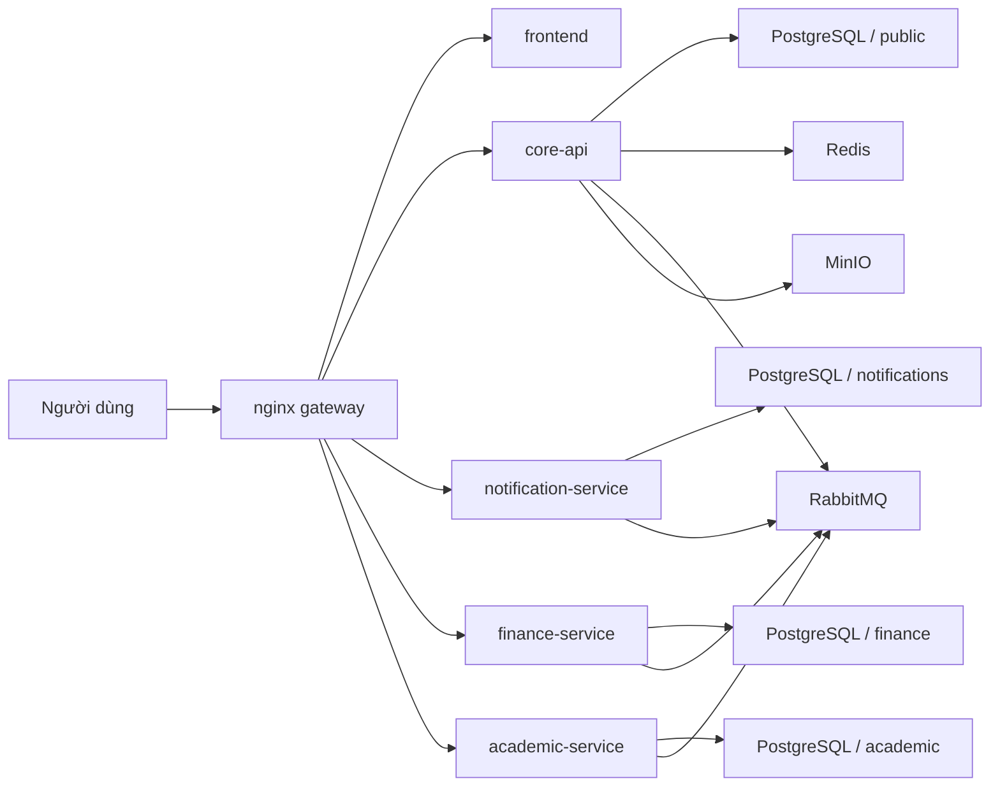

# CampusCore

[](https://github.com/JasonTM17/CampusCore_FullStack_Individual/actions/workflows/ci.yml)
[](https://github.com/JasonTM17/CampusCore_FullStack_Individual/actions/workflows/cd.yml)


CampusCore là một dự án quản lý học vụ được nâng cấp theo hướng **Microservices Portfolio v3**. Ở trạng thái hiện tại, hệ thống có một `core-api` giữ auth và identity, một `notification-service` cho notification inbox và realtime delivery, một `finance-service` cho domain tài chính, một `academic-service` cho domain học vụ công khai, một `frontend`, và một `nginx gateway` làm public edge duy nhất.

README này là bản chính bằng **tiếng Việt có dấu**. Bản song ngữ đi kèm:

- [README.vi.md](./README.vi.md)
- [README.en.md](./README.en.md)

## Kiến trúc hiện tại

CampusCore hiện chạy như một stack nhiều service thật:

- `frontend`: Next.js 15, runtime production-like bằng standalone mode
- `core-api`: NestJS 11, owner của auth, session, users, roles, permissions, students, lecturers, announcements, analytics, finance-context và public health
- `notification-service`: NestJS 11, owner của notification inbox, unread count, websocket `/notifications`, RabbitMQ consumer và realtime fan-out
- `finance-service`: NestJS 11, owner của invoices, invoice items, payments, scholarships, student scholarships và finance events
- `academic-service`: NestJS 11, owner của faculties, departments, academic years, semesters, courses, curricula, classrooms, sections, enrollments, grades, waitlist, attendance và schedules
- `nginx`: public gateway

Hạ tầng dùng chung:

- PostgreSQL theo mô hình **một cluster, nhiều schema theo service**
- Redis
- RabbitMQ
- MinIO



## Boundary theo service

| Thành phần | Sở hữu | Không sở hữu |
| --- | --- | --- |
| `core-api` | auth, session, users, roles, permissions, students, lecturers, announcements, analytics, finance-context, `/health` | notification inbox, finance tables, public academic APIs |
| `notification-service` | notification inbox, unread count, websocket `/notifications`, realtime broadcast | auth source of truth, academic master-data, finance data |
| `finance-service` | invoices, payments, scholarships, finance exports, finance events | users và dữ liệu học vụ source of truth |
| `academic-service` | public academic APIs, faculties, departments, semesters, courses, sections, enrollments, grades, attendance, schedules | auth source of truth, public health, finance context |

## Public contract

Public edge luôn đi qua `nginx`. Frontend giữ nguyên public path, chỉ đổi owner phía sau gateway:

| URL | Mục đích | Owner phía sau gateway |
| --- | --- | --- |
| `http://localhost/` | Web app | `frontend` |
| `http://localhost/login` | Đăng nhập | `frontend` |
| `http://localhost/health` | Public liveness tối giản | `core-api` |
| `http://localhost/api/docs` | Swagger public | `core-api` |
| `http://localhost/api/v1/notifications/*` | Notifications API | `notification-service` |
| `http://localhost/socket.io/*` | Realtime gateway | `notification-service` |
| `http://localhost/api/v1/finance/*` | Finance API | `finance-service` |
| `http://localhost/api/v1/academic-years/*` và các route học vụ tương ứng | Academic API | `academic-service` |

Các path sau không public qua `nginx`:

- `GET /api/v1/health/liveness`
- `GET /api/v1/health/readiness`
- `GET /internal/*`

## Auth và health model

Browser flow dùng contract chung trên các service:

- `cc_access_token`
- `cc_refresh_token`
- `cc_csrf`
- `X-CSRF-Token` cho request mutating khi auth bằng cookie

Tương thích legacy vẫn được giữ:

- JSON `accessToken`, `refreshToken`, `user`
- `Authorization: Bearer ...`

Health model:

- `GET /health`: public liveness của `core-api`
- `GET /api/v1/health/readiness`: internal readiness, yêu cầu `X-Health-Key` ở production-like flow

## Dữ liệu và ownership

CampusCore dùng chiến lược **per-service schema**:

- `core-api` -> `schema=public`
- `notification-service` -> `schema=notifications`
- `finance-service` -> `schema=finance`
- `academic-service` -> `schema=academic`

`academic-service` dùng **snapshot one-time** cho `User`, `Student`, `Lecturer` trong schema riêng để tự join dữ liệu học vụ. Ở v3, `students` và `lecturers` vẫn là identity/profile owner của `core-api`.

`finance-service` tiếp tục đọc internal finance context từ `core-api` qua `X-Service-Token`. Vòng này chưa chuyển finance read-through sang `academic-service`.

## Khởi động nhanh

### Dev stack

```bash
cp .env.example .env
docker compose up -d --build
```

Trình tự boot ở dev:

1. `postgres`, `redis`, `rabbitmq`, `minio`
2. `core-api-init`
3. `notification-service-init`
4. `finance-service-init`
5. `academic-service-init`
6. `core-api`, `notification-service`, `finance-service`, `academic-service`, `frontend`, `nginx`

### Production-like stack

```bash
export DOCKERHUB_NAMESPACE=<namespace>
export IMAGE_TAG=v1.0.0
docker compose -f docker-compose.production.yml --profile bootstrap run --rm core-api-init
docker compose -f docker-compose.production.yml --profile bootstrap run --rm notification-service-init
docker compose -f docker-compose.production.yml --profile bootstrap run --rm finance-service-init
docker compose -f docker-compose.production.yml --profile bootstrap run --rm academic-service-init
docker compose -f docker-compose.production.yml up -d
```

Ở production-like flow, runtime container không tự chạy migration. Bootstrap schema là bước vận hành bắt buộc trước first deploy.

## Verification matrix

Tối thiểu nên verify đủ:

- `backend/core-api`: lint, format, typecheck, build, unit test, integration test
- `notification-service`: lint, format, typecheck, build, unit test, integration test
- `finance-service`: lint, format, typecheck, build, unit test, integration test
- `academic-service`: lint, format, typecheck, build, unit test, integration test
- `frontend`: lint, typecheck, test, build, fast E2E
- `node scripts/run-image-smoke.mjs`
- `cd frontend && npm run test:e2e:edge`
- `node scripts/run-security-local.mjs`
- `docker compose -f docker-compose.yml config`
- `docker compose -f docker-compose.production.yml config`
- `docker compose -f docker-compose.e2e.yml config`
- `git diff --check`

## Release policy

CampusCore dùng policy **semver-only public release**:

- branch `master` hoặc `main` chỉ chạy CI
- public registry chỉ publish khi push tag `vX.Y.Z`
- `latest` chỉ di chuyển cùng một semver release
- mỗi release phải publish đủ **5 image**:
  - `campuscore-backend`
  - `campuscore-notification-service`
  - `campuscore-finance-service`
  - `campuscore-academic-service`
  - `campuscore-frontend`

## Registry

### Docker Hub

- `nguyenson1710/campuscore-backend`
- `nguyenson1710/campuscore-notification-service`
- `nguyenson1710/campuscore-finance-service`
- `nguyenson1710/campuscore-academic-service`
- `nguyenson1710/campuscore-frontend`

### GitHub Container Registry

- `ghcr.io/jasontm17/campuscore-backend`
- `ghcr.io/jasontm17/campuscore-notification-service`
- `ghcr.io/jasontm17/campuscore-finance-service`
- `ghcr.io/jasontm17/campuscore-academic-service`
- `ghcr.io/jasontm17/campuscore-frontend`

## Tài liệu bổ sung

- [README.vi.md](./README.vi.md)
- [README.en.md](./README.en.md)
- [docs/ARCHITECTURE.md](./docs/ARCHITECTURE.md)
- [docs/OPERATIONS.md](./docs/OPERATIONS.md)
- [docs/SECURITY.md](./docs/SECURITY.md)
- [docs/RELEASE.md](./docs/RELEASE.md)
- [DOCKER_HUB.md](./DOCKER_HUB.md)

## Tác giả

Nguyễn Tiến Sơn

- GitHub: [JasonTM17](https://github.com/JasonTM17)
- Email: [jasonbmt06@gmail.com](mailto:jasonbmt06@gmail.com)
