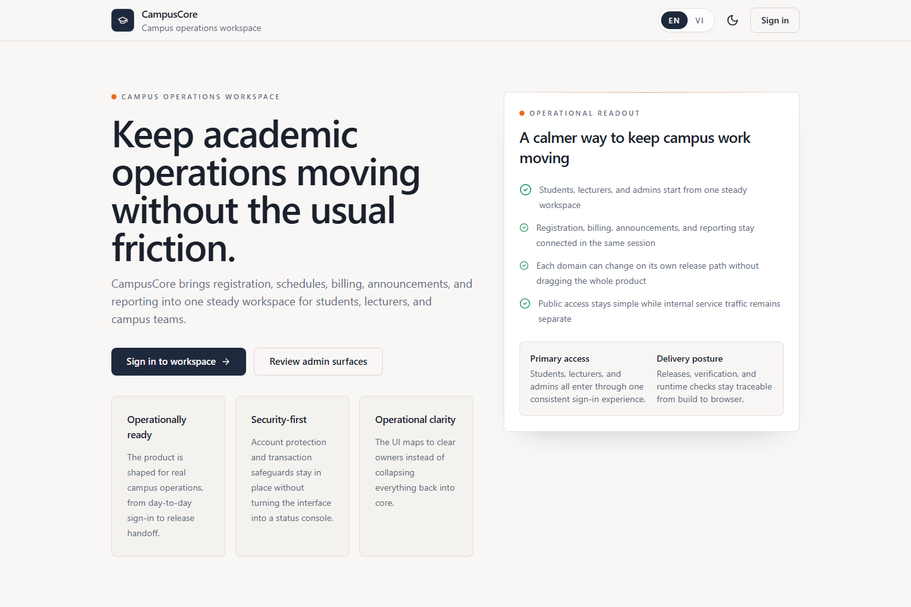

# CampusCore

CampusCore is a production-like university operations platform built as a release-verified microservices portfolio. It combines a Next.js frontend, a NestJS service mesh, a single public `nginx` edge, bilingual product UX, sandbox-ready student payments, and an operator monitoring stack designed for realistic local and Kubernetes handoff workflows.

- Public site: [https://tienson.io.vn](https://tienson.io.vn)
- Latest release: [`v1.4.0`](./docs/releases/v1.4.0.md)
- English docs: [README.en.md](./README.en.md)
- Vietnamese docs: [README.vi.md](./README.vi.md)

> **Live domain note:** `https://tienson.io.vn` is Cloudflare-managed. It resolves to CampusCore only when a production origin or the documented Cloudflare Tunnel/local edge is running. If the domain is unavailable, use the local edge workflow in [docs/CLOUDFLARE.md](./docs/CLOUDFLARE.md) or run the stack locally from the commands below.

## Release Status

- Current release: [`v1.4.0`](https://github.com/JasonTM17/CampusCore_FullStack_Individual/releases/tag/v1.4.0)
- Release notes: [docs/releases/v1.4.0.md](./docs/releases/v1.4.0.md)
- Published topology: 9 images across GHCR and Docker Hub
- Verification posture: CI quality gate, CD publish, manifest verification, image smoke, edge E2E, and security scan

## Highlights

- Stable browser auth contract with `cc_access_token`, `cc_refresh_token`, `cc_csrf`, and `X-CSRF-Token`
- Bilingual application shell with canonical `/en/*` and `/vi/*` routes
- Nine-image release topology across platform, domain, and frontend services
- Sandbox-ready student checkout orchestration for VNPay, ZaloPay, MoMo, PayPal, and hosted card flows
- Operator observability with Grafana, Prometheus, Loki, Promtail, and Tempo
- Local-first Docker Compose and Kubernetes handoff paths with guarded internal boundaries

## Runtime Topology

CampusCore currently ships the following public runtime images:

1. `campuscore-backend`
2. `campuscore-auth-service`
3. `campuscore-notification-service`
4. `campuscore-finance-service`
5. `campuscore-academic-service`
6. `campuscore-engagement-service`
7. `campuscore-people-service`
8. `campuscore-analytics-service`
9. `campuscore-frontend`

The public edge stays intentionally simple:

- `nginx` is the single browser-facing gateway
- `frontend` is the product shell
- `core-api` keeps platform-level health and compatibility responsibilities
- domain services own their public contracts behind the gateway

## Public Service Ownership

- `/api/v1/auth/*`, `/api/v1/users/*`, `/api/v1/roles/*`, `/api/v1/permissions/*` -> `auth-service`
- `/api/v1/students/*`, `/api/v1/lecturers/*` -> `people-service`
- `/api/v1/notifications/*`, `/socket.io/*` -> `notification-service`
- `/api/v1/finance/*` -> `finance-service`
- public academic routes -> `academic-service`
- announcements and support tickets -> `engagement-service`
- `/api/v1/analytics/*` -> `analytics-service`
- `/health` -> `core-api`

Not public:

- `/internal/*`
- `/api/v1/internal/*`
- internal readiness endpoints
- internal monitoring surfaces such as `/metrics`

## Why This Repo Exists

CampusCore is designed to feel closer to a real commercial product than a toy campus portal:

- auth and IAM stay in their own ownership boundary
- academic, finance, engagement, people, and analytics concerns scale independently
- release verification checks all published images, not just source code
- student and operator journeys are both treated as first-class product surfaces
- local development can stay realistic without silently becoming production

## Operator Surfaces

Local operator tooling stays internal-only:

- CampusCore app through local edge or domain
- Admin analytics cockpit inside the app
- Grafana on `127.0.0.1:3002`
- Prometheus on `127.0.0.1:9090`

See [docs/OPERATIONS.md](./docs/OPERATIONS.md), [docs/SECURITY.md](./docs/SECURITY.md), and [docs/RELEASE.md](./docs/RELEASE.md) for runtime and release details.

## Documentation Map

- [README.en.md](./README.en.md)
- [README.vi.md](./README.vi.md)
- [docs/releases/TEMPLATE.md](./docs/releases/TEMPLATE.md)
- [docs/releases/v1.4.0.md](./docs/releases/v1.4.0.md)
- [docs/ARCHITECTURE.md](./docs/ARCHITECTURE.md)
- [docs/OPERATIONS.md](./docs/OPERATIONS.md)
- [docs/SECURITY.md](./docs/SECURITY.md)
- [docs/RELEASE.md](./docs/RELEASE.md)
- [docs/CLOUDFLARE.md](./docs/CLOUDFLARE.md)
- [docs/K8S_HANDOFF.md](./docs/K8S_HANDOFF.md)
- [k8s/README.md](./k8s/README.md)
