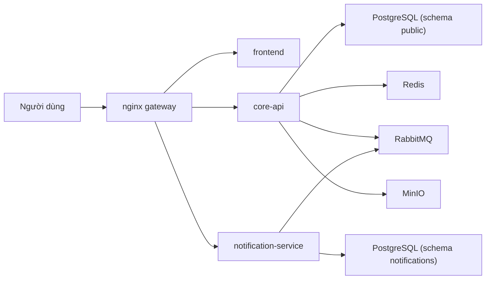

# CampusCore

[](https://github.com/JasonTM17/CampusCore_FullStack_Individual/actions/workflows/ci.yml)
[](https://github.com/JasonTM17/CampusCore_FullStack_Individual/actions/workflows/cd.yml)


CampusCore là nền tảng quản lý học vụ được xây theo hướng **microservices portfolio v1**. Ở trạng thái hiện tại, hệ thống có một `core-api` chịu trách nhiệm auth, học vụ và vận hành chính, cùng một `notification-service` độc lập chịu trách nhiệm inbox thông báo và realtime delivery. Phần public edge đi qua `nginx`, còn dữ liệu và hạ tầng dùng chung gồm PostgreSQL, Redis, RabbitMQ và MinIO.

## Ngôn ngữ

- [Tiếng Việt](./README.vi.md)
- [English](./README.en.md)

## Kiến trúc hiện tại

CampusCore hiện có 3 deployable ứng dụng:

- `frontend`: Next.js 15, chạy production-like bằng standalone runtime
- `core-api`: NestJS 11, sở hữu auth, users, announcements, enrollments, finance, grades, schedules, analytics và public health
- `notification-service`: NestJS 11, sở hữu notification inbox, websocket `/notifications`, RabbitMQ consumer và notification health riêng



## Public contract

| URL                                        | Mục đích                                                  |
| ------------------------------------------ | --------------------------------------------------------- |
| `http://localhost`                         | Public entrypoint qua nginx                               |
| `http://localhost/login`                   | Trang đăng nhập                                           |
| `http://localhost/health`                  | Public liveness của `core-api`                            |
| `http://localhost/api/docs`                | Swagger qua nginx                                         |
| `http://localhost/api/v1/notifications/*`  | Notifications API public, owner là `notification-service` |
| `http://localhost/socket.io/*`             | Socket.IO public, route tới `notification-service`        |
| `http://localhost/api/v1/health/readiness` | Bị chặn ở public edge                                     |

## Auth model

Browser flow dùng:

- `cc_access_token`
- `cc_refresh_token`
- `cc_csrf`
- header `X-CSRF-Token` cho request mutating

Legacy clients vẫn được giữ tương thích bằng JSON `accessToken`, `refreshToken`, `user` và Bearer token.

## Health model

- `GET /health`: public liveness tối giản của `core-api`
- `GET /api/v1/health/readiness`: internal readiness của `core-api`
- `GET /api/v1/health/liveness`: internal liveness của từng service
- `notification-service` cũng có readiness/liveness riêng nhưng không public qua nginx

## Quick start

### Local full stack

```bash
cp .env.example .env
docker compose up -d --build
```

Compose dev sẽ boot theo thứ tự:

1. `postgres`, `redis`, `rabbitmq`, `minio`
2. `core-api-init` để push schema `public` và seed dữ liệu
3. `notification-service-init` để push schema `notifications` và copy legacy notifications một lần nếu bảng cũ tồn tại
4. `core-api`, `notification-service`, `frontend`, `nginx`

### Production-like stack

```bash
export DOCKERHUB_NAMESPACE=<namespace>
export IMAGE_TAG=v1.0.0
docker compose -f docker-compose.production.yml --profile bootstrap run --rm core-api-init
docker compose -f docker-compose.production.yml --profile bootstrap run --rm notification-service-init
docker compose -f docker-compose.production.yml up -d
```

Ở production compose, application container không tự chạy migration. Bước bootstrap schema phải chạy trước first deploy theo hướng dẫn ở [docs/OPERATIONS.md](./docs/OPERATIONS.md).

## Verification matrix

CampusCore được khóa bằng nhiều lớp verify:

- `core-quality`
- `core-integration`
- `notification-quality`
- `notification-integration`
- `frontend-quality`
- `frontend-fast-e2e`
- `compose-contract`
- `image-smoke`
- `edge-e2e`
- `security-scan`
- `dependency-review`
- `quality-gate`

### Local verification

- `cd backend && npm run lint && npm run lint:format && npm run typecheck && npm run build && npm run test:unit -- --runInBand && npm run test:integration -- --runInBand`
- `cd notification-service && npm run lint && npm run lint:format && npm run typecheck && npm run build && npm run test:unit -- --runInBand && npm run test:integration -- --runInBand`
- `cd frontend && npm run lint && npm run typecheck && npm test && npm run build && npm run test:e2e`
- `node scripts/run-image-smoke.mjs`
- `cd frontend && npm run test:e2e:edge`
- `node scripts/run-security-local.mjs`
- `docker compose -f docker-compose.yml config`
- `docker compose -f docker-compose.production.yml config`
- `docker compose -f docker-compose.e2e.yml config`
- `git diff --check`

## Release policy

- Public registry chỉ publish từ tag semver `vX.Y.Z`
- `master`/`main` chỉ chạy CI, không publish release public
- Mỗi release đẩy đủ 3 image:
  - `campuscore-backend`
  - `campuscore-notification-service`
  - `campuscore-frontend`
- Tag phát hành gồm:
  - semver tag, ví dụ `v1.0.0`
  - short SHA immutable
  - `latest` chỉ cập nhật cùng semver release

## Registry

### Docker Hub

- `nguyenson1710/campuscore-backend`
- `nguyenson1710/campuscore-notification-service`
- `nguyenson1710/campuscore-frontend`

### GitHub Container Registry

- `ghcr.io/jasontm17/campuscore-backend`
- `ghcr.io/jasontm17/campuscore-notification-service`
- `ghcr.io/jasontm17/campuscore-frontend`

## Tài liệu bổ sung

- [README tiếng Việt](./README.vi.md)
- [README tiếng Anh](./README.en.md)
- [Kiến trúc](./docs/ARCHITECTURE.md)
- [Vận hành](./docs/OPERATIONS.md)
- [Bảo mật](./docs/SECURITY.md)
- [Phát hành](./docs/RELEASE.md)
- [Docker Hub Guide](./DOCKER_HUB.md)

## Tác giả

Nguyễn Tiến Sơn

- GitHub: [JasonTM17](https://github.com/JasonTM17)
- Email: [jasonbmt06@gmail.com](mailto:jasonbmt06@gmail.com)
