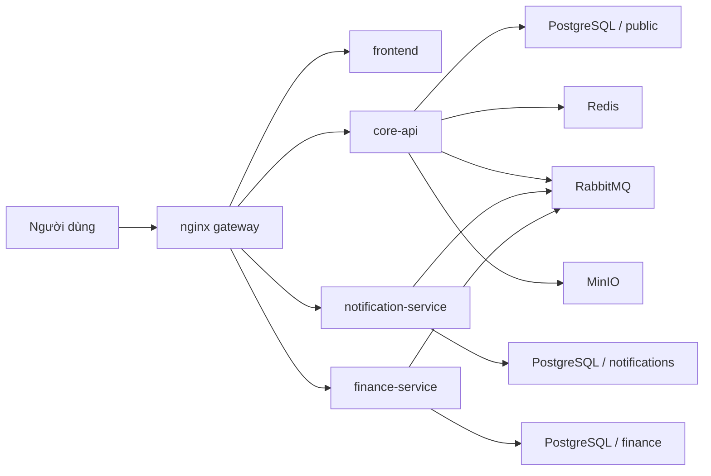

# CampusCore

[](https://github.com/JasonTM17/CampusCore_FullStack_Individual/actions/workflows/ci.yml)
[](https://github.com/JasonTM17/CampusCore_FullStack_Individual/actions/workflows/cd.yml)


CampusCore là dự án quản lý học vụ được phát triển theo hướng **Microservices Portfolio v2**. Ở trạng thái hiện tại, hệ thống có một `core-api` giữ vai trò system of record cho auth và học vụ, một `notification-service` phụ trách notification inbox cùng realtime delivery, một `finance-service` phụ trách toàn bộ finance domain, một `frontend` cho trải nghiệm người dùng, và một `nginx gateway` làm public edge thống nhất.

README này là bản chính bằng **tiếng Việt có dấu**. Bản song ngữ đi kèm:

- [README.vi.md](./README.vi.md)
- [README.en.md](./README.en.md)

## Tổng quan kiến trúc

CampusCore hiện có 4 deployable ứng dụng công khai trong pipeline phát hành:

- `frontend`: Next.js 15, production-like runtime bằng standalone mode
- `core-api`: NestJS 11, sở hữu auth, session, users, roles, permissions, students, semesters, enrollments, sections, grades, schedules, announcements và public health
- `notification-service`: NestJS 11, sở hữu notification inbox, websocket `/notifications`, RabbitMQ consumer và realtime fan-out
- `finance-service`: NestJS 11, sở hữu invoices, invoice items, payments, scholarships, student scholarships và finance event publishing

Hạ tầng dùng chung:

- `nginx` làm gateway công khai duy nhất
- PostgreSQL dùng chung cụm nhưng tách **schema theo service**
- Redis cho cache và session phụ trợ
- RabbitMQ cho event-driven integration
- MinIO cho object storage contract ở tầng triển khai



## Ownership theo domain

| Thành phần | Sở hữu chính | Không sở hữu |
| --- | --- | --- |
| `core-api` | auth, session, identity, users, roles, permissions, students, semesters, enrollments, sections, grades, schedules, announcements, public `/health` | notification inbox, finance data |
| `notification-service` | notification inbox, unread count, websocket `/notifications`, consume event để phát realtime hoặc persist inbox | auth source of truth, academic domain, finance tables |
| `finance-service` | invoices, invoice items, payments, scholarships, student scholarships, finance event publishing | users, semesters, enrollments source of truth |

## Public contract

Public edge luôn đi qua `nginx`. Frontend không cần đổi path công khai khi hệ thống tách service.

| URL | Mục đích | Owner phía sau gateway |
| --- | --- | --- |
| `http://localhost/` | Web app | `frontend` |
| `http://localhost/login` | Đăng nhập | `frontend` |
| `http://localhost/health` | Public liveness tối giản | `core-api` |
| `http://localhost/api/docs` | Swagger public | `core-api` |
| `http://localhost/api/v1/notifications/*` | Notifications API | `notification-service` |
| `http://localhost/socket.io/*` | Realtime gateway | `notification-service` |
| `http://localhost/api/v1/finance/*` | Finance API | `finance-service` |

Các path sau **không public** qua `nginx`:

- `GET /api/v1/health/readiness`
- `GET /api/v1/health/liveness`
- `GET /internal/v1/finance-context/students/:studentId`
- `GET /internal/v1/finance-context/semesters/:semesterId`
- `GET /internal/v1/finance-context/semesters/:semesterId/billable-students`

## Auth và session model

Browser flow dùng contract thống nhất giữa các service:

- cookie `cc_access_token`
- cookie `cc_refresh_token`
- cookie `cc_csrf`
- header `X-CSRF-Token` cho request mutating khi auth bằng cookie

Tương thích legacy vẫn được giữ:

- JSON `accessToken`, `refreshToken`, `user`
- `Authorization: Bearer ...`

Thứ tự đọc auth token:

1. Bearer token
2. Cookie `cc_access_token`

## Data model và service boundary

CampusCore dùng chiến lược **per-service schema trên cùng cụm PostgreSQL**:

- `core-api` dùng `schema=public`
- `notification-service` dùng `schema=notifications`
- `finance-service` dùng `schema=finance`

Không service nào được join trực tiếp vào schema của service khác ở runtime path chính. Cross-service read cho finance đi qua **internal HTTP** từ `finance-service` sang `core-api` bằng header `X-Service-Token`, chỉ để:

- xác thực `studentId`
- xác thực `semesterId`
- lấy danh sách billable students
- lấy snapshot hiển thị để đóng băng vào invoice

`finance-service` lưu snapshot cần thiết ngay trên invoice:

- `studentDisplayName`
- `studentEmail`
- `studentCode`
- `semesterName`

## Event flow chính

Envelope event chuẩn của repo gồm:

- `type`
- `source`
- `occurredAt`
- `payload`

Các luồng đáng chú ý trong v2:

- `core-api` publish `announcement.created`
- `core-api` có thể publish `notification.user.created` và `notification.role.created`
- `finance-service` publish:
  - `invoice.created`
  - `invoice.status.changed`
  - `payment.completed`
- `notification-service` consume event để tạo inbox hoặc phát realtime billing notification

## Khởi động nhanh

### Local full stack

```bash
cp .env.example .env
docker compose up -d --build
```

Trình tự boot ở dev compose:

1. `postgres`, `redis`, `rabbitmq`, `minio`
2. `core-api-init` để push schema `public` và seed dữ liệu
3. `notification-service-init` để push schema `notifications` và migrate notification legacy
4. `finance-service-init` để push schema `finance` và migrate finance legacy
5. `core-api`, `notification-service`, `finance-service`, `frontend`, `nginx`

### Production-like stack

```bash
export DOCKERHUB_NAMESPACE=<namespace>
export IMAGE_TAG=v1.0.0
docker compose -f docker-compose.production.yml --profile bootstrap run --rm core-api-init
docker compose -f docker-compose.production.yml --profile bootstrap run --rm notification-service-init
docker compose -f docker-compose.production.yml --profile bootstrap run --rm finance-service-init
docker compose -f docker-compose.production.yml up -d
```

Ở production compose, app container không tự chạy migration. Bootstrap schema là bước vận hành bắt buộc trước first deploy.

## Verification ở mức portfolio

Một vòng kiểm tra đầy đủ nên bao phủ cả 4 ứng dụng:

- `backend/core-api`: lint, format, typecheck, build, unit test, integration test
- `notification-service`: lint, format, typecheck, build, unit test, integration test
- `finance-service`: lint, format, typecheck, build, unit test, integration test
- `frontend`: lint, typecheck, test, build, fast E2E
- stack runtime: image smoke, edge E2E, compose contract, security sweep

Local verification tham chiếu:

- `cd backend && npm run lint && npm run lint:format && npm run typecheck && npm run build && npm run test:unit -- --runInBand && npm run test:integration -- --runInBand`
- `cd notification-service && npm run lint && npm run lint:format && npm run typecheck && npm run build && npm run test:unit -- --runInBand && npm run test:integration -- --runInBand`
- `cd finance-service && npm run lint && npm run lint:format && npm run typecheck && npm run build && npm run test:unit -- --runInBand && npm run test:integration -- --runInBand`
- `cd frontend && npm run lint && npm run typecheck && npm test && npm run build && npm run test:e2e`
- `node scripts/run-image-smoke.mjs`
- `cd frontend && npm run test:e2e:edge`
- `node scripts/run-security-local.mjs`
- `docker compose -f docker-compose.yml config`
- `docker compose -f docker-compose.production.yml config`
- `docker compose -f docker-compose.e2e.yml config`
- `git diff --check`

## Release policy

CampusCore dùng policy **semver-only public release**:

- public registry chỉ publish khi push tag `vX.Y.Z`
- branch `master` hoặc `main` chỉ chạy CI
- `latest` chỉ di chuyển cùng một semver release
- public release phải mang đủ 4 image:
  - `campuscore-backend`
  - `campuscore-notification-service`
  - `campuscore-finance-service`
  - `campuscore-frontend`

## Registry

### Docker Hub

- `nguyenson1710/campuscore-backend`
- `nguyenson1710/campuscore-notification-service`
- `nguyenson1710/campuscore-finance-service`
- `nguyenson1710/campuscore-frontend`

### GitHub Container Registry

- `ghcr.io/jasontm17/campuscore-backend`
- `ghcr.io/jasontm17/campuscore-notification-service`
- `ghcr.io/jasontm17/campuscore-finance-service`
- `ghcr.io/jasontm17/campuscore-frontend`

## Tài liệu bổ sung

- [README.vi.md](./README.vi.md)
- [README.en.md](./README.en.md)
- [docs/ARCHITECTURE.md](./docs/ARCHITECTURE.md)
- [docs/OPERATIONS.md](./docs/OPERATIONS.md)
- [docs/SECURITY.md](./docs/SECURITY.md)
- [docs/RELEASE.md](./docs/RELEASE.md)
- [DOCKER_HUB.md](./DOCKER_HUB.md)

## Tác giả

Nguyễn Tiến Sơn

- GitHub: [JasonTM17](https://github.com/JasonTM17)
- Email: [jasonbmt06@gmail.com](mailto:jasonbmt06@gmail.com)
