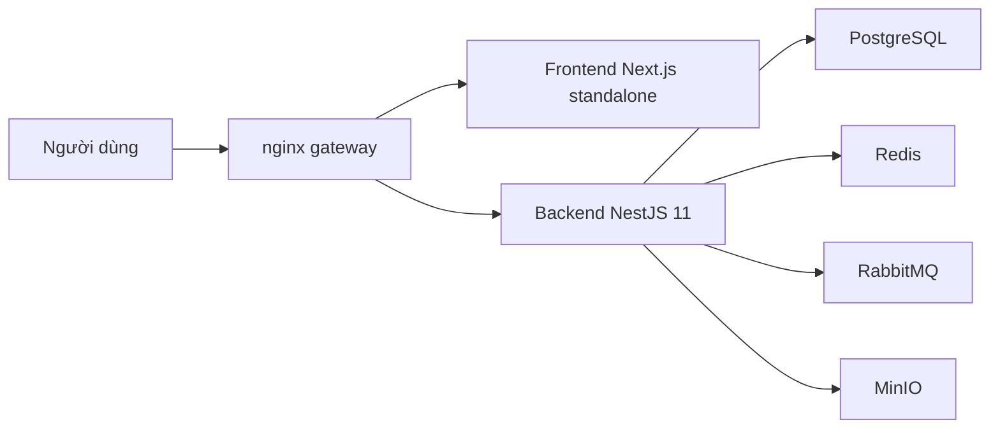

# CampusCore

[](https://github.com/JasonTM17/CampusCore_FullStack_Individual/actions/workflows/ci.yml)
[](https://github.com/JasonTM17/CampusCore_FullStack_Individual/actions/workflows/cd.yml)


CampusCore là nền tảng quản lý học vụ cho đăng ký học phần, thời khóa biểu, điểm số, hóa đơn học phí, thông báo và vận hành quản trị.

Repo hiện giữ **một backend NestJS 11 deployable duy nhất**, nhưng được kiểm chứng theo kiểu **multi-service stack** với nginx, PostgreSQL, Redis, RabbitMQ, MinIO, image smoke và E2E tập trung. Nhờ vậy, kiến trúc triển khai vẫn gọn, nhưng hành vi runtime được kiểm tra sát với môi trường sản phẩm.

## Ngôn Ngữ

- [Tiếng Việt](./README.vi.md)
- [English](./README.en.md)

## Tóm Tắt Nhanh

- Frontend Next.js 15 chạy bằng standalone runtime trong Docker
- Public surface đi qua nginx tại `http://localhost`
- `GET /health` là liveness công khai tối giản
- Canonical readiness là `GET /api/v1/health/readiness`
- Browser auth dùng cookie `HttpOnly` + CSRF
- Legacy clients vẫn được hỗ trợ bằng JSON token/Bearer trong giai đoạn chuyển tiếp
- Release public chỉ phát hành từ tag semver `vX.Y.Z`

## Kiến Trúc Thực Tế

| URL | Mục đích |
| --- | --- |
| `http://localhost` | Điểm vào công khai qua nginx |
| `http://localhost/login` | Trang đăng nhập |
| `http://localhost/health` | Liveness công khai, payload tối giản |
| `http://localhost/api/docs` | Swagger UI qua nginx |
| `http://localhost/api/v1/health/readiness` | Readiness nội bộ, cần `X-Health-Key` trong môi trường production-like |
| `http://localhost:4000/api/v1/health/liveness` | Liveness backend trực tiếp trong local stack |

Trong Docker, frontend lắng nghe ở cổng `3000`, backend ở cổng `4000`, và nginx là cổng công khai duy nhất của stack runtime.



## Luồng Chức Năng

### Sinh viên

- Đăng ký học phần
- Xem lịch học theo tuần
- Xem điểm và bảng điểm
- Theo dõi hóa đơn học phí
- Xem thông báo
- Quản lý hồ sơ cá nhân

### Giảng viên

- Lịch giảng dạy
- Quản lý điểm
- Dashboard có hỗ trợ empty state khi chưa có dữ liệu

### Quản trị

- Quản lý người dùng
- Quản lý môn học và lớp học phần
- Quản lý đăng ký
- Dashboard vận hành

## Auth Hiện Tại

Browser flow dùng các cookie:

- `cc_access_token`
- `cc_refresh_token`
- `cc_csrf`

Các request mutating từ browser gửi `X-CSRF-Token`. Các client cũ vẫn có thể dùng response JSON có `accessToken`, `refreshToken`, `user` và Bearer header để không gãy tích hợp ngoài repo.

## Health Hiện Tại

- `GET /health`: public liveness tối giản
- `GET /api/v1/health/readiness`: readiness nội bộ chi tiết
- `GET /api/v1/health`: alias chuyển tiếp cho readiness để giữ tương thích

Readiness phản ánh trung thực trạng thái `database`, `redis`, `rabbitmq` theo các mức `up`, `down`, `not_configured`.

## Container Images Và Registry

### Docker Hub

- `nguyenson1710/campuscore-backend`
- `nguyenson1710/campuscore-frontend`

### GitHub Container Registry

- `ghcr.io/jasontm17/campuscore-backend`
- `ghcr.io/jasontm17/campuscore-frontend`

Tags được phát hành theo cùng một quy ước:

- `latest`
- tag semver như `v1.0.0`
- tag SHA bất biến như `0f8bc44`

Public release chỉ được publish từ tag semver `vX.Y.Z`. Nhánh thường chỉ chạy CI và không được dùng để phát hành public.

## Khởi Động Nhanh

### Chạy local full stack

```bash
cp .env.example .env
docker compose up -d --build
```

Mở:

- `http://localhost`
- `http://localhost/api/docs`
- `http://localhost/health`

### Chạy production-like

```bash
docker compose -f docker-compose.production.yml up -d
```

Frontend production-like dùng standalone runtime. Trong mode này, image không lấy `next start` làm đường chạy chính.

## Chọn Đúng Chế Độ Chạy

Để tránh cảm giác "lệnh đứng im", repo này nên được chạy theo đúng mục tiêu:

- **Debug nhanh local**
  - backend: `cd backend && npm run start`
  - frontend: `cd frontend && npm run dev -- --hostname 127.0.0.1 --port 3100`
- **Fast verify**
  - `cd frontend && npm run test:e2e`
- **Production-like verify**
  - `cd frontend && npm run test:e2e:edge`

Không dùng `npm run dev` mơ hồ ở root. Nếu mục tiêu chỉ là kiểm tra app có boot được hay không, hãy chạy local smoke trước rồi mới nâng lên E2E.

Mốc thời gian tham chiếu:

- local dev: thường dưới 2-3 phút
- fast E2E: thường dưới 6-8 phút
- edge E2E: thường dưới 10-12 phút

Khi bài test nặng cần debug, đọc log tại:

- `frontend/test-results/fast-e2e-stack`
- `frontend/test-results/edge-e2e-stack`

## Kiểm Thử

Repo hiện được khóa bằng:

- backend lint, format check, typecheck, build, unit test và integration test
- frontend lint, typecheck, build, smoke test và E2E
- image smoke production-like từ Dockerfile thật
- edge E2E qua nginx
- Docker compose contract cho dev, prod và E2E
- security scan cho source và image

## CI/CD

GitHub Actions hiện đóng vai trò quality gate và release gate:

- `CI Build and Test` chạy toàn bộ kiểm tra chất lượng, integration, E2E, image smoke và security scan
- `CD - Gated Registry Publish` chỉ publish registry khi commit đã vượt qua quality gate và ref là tag semver `vX.Y.Z`

Quy ước publish:

- `DOCKERHUB_NAMESPACE` là namespace ưu tiên
- `DOCKERHUB_USERNAME` là legacy alias để tương thích
- `latest` chỉ cập nhật khi có release semver
- rollback nên dùng digest hoặc tag SHA bất biến

## Tài Liệu Bổ Sung

- [README tiếng Anh](./README.en.md)
- [Docker Hub Guide](./DOCKER_HUB.md)
- [Kiến trúc](./docs/ARCHITECTURE.md)
- [Vận hành](./docs/OPERATIONS.md)
- [Bảo mật](./docs/SECURITY.md)
- [Phát hành](./docs/RELEASE.md)

## Tác Giả

Nguyễn Tiến Sơn

- GitHub: [JasonTM17](https://github.com/JasonTM17)
- Email: [jasonbmt06@gmail.com](mailto:jasonbmt06@gmail.com)
