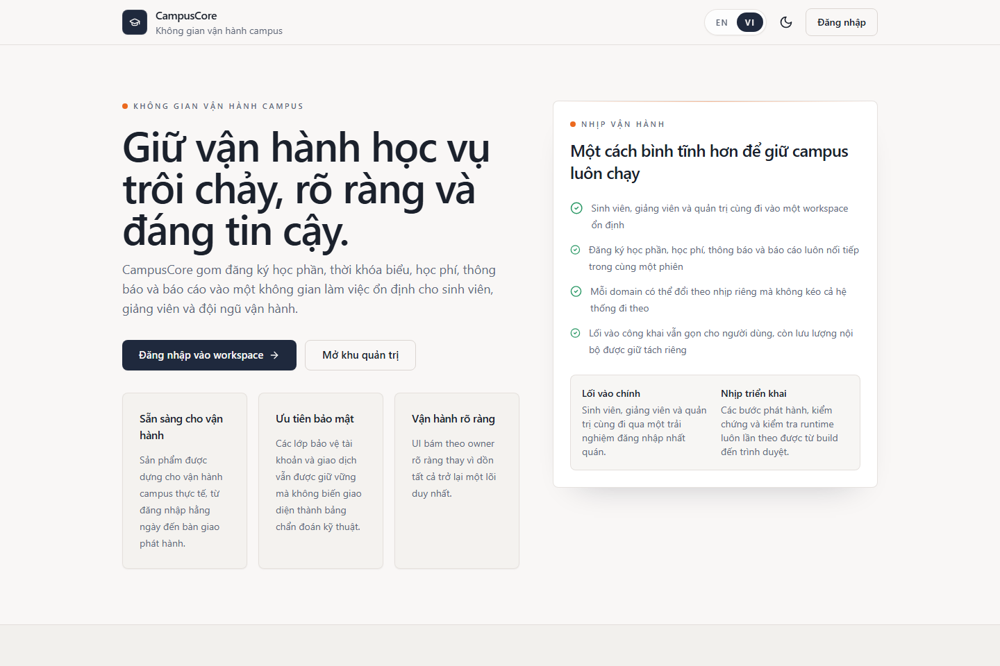

# CampusCore (Tiếng Việt)

CampusCore là một nền tảng vận hành đại học theo hướng production-like, được xây như một portfolio microservices có thể release, kiểm chứng và handoff thật sự. Hệ thống hiện kết hợp frontend Next.js, các dịch vụ NestJS, một `nginx` public edge duy nhất, giao diện song ngữ, thanh toán sinh viên ở mức sandbox-ready, và lớp observability dành cho operator.

- Website public: [https://tienson.io.vn](https://tienson.io.vn)
- Release mới nhất: [`v1.4.0`](./docs/releases/v1.4.0.md)
- Tài liệu tiếng Anh: [README.en.md](./README.en.md)
- Tài liệu gốc repo: [README.md](./README.md)

> **Ghi chú về domain:** `https://tienson.io.vn` đang được quản lý bằng Cloudflare. Domain chỉ vào được CampusCore khi có production origin hoặc Cloudflare Tunnel/local edge trong tài liệu đang chạy. Nếu domain chưa vào được, hãy dùng hướng dẫn local edge trong [docs/CLOUDFLARE.md](./docs/CLOUDFLARE.md) hoặc chạy stack local bằng các lệnh bên dưới.

## Trạng thái release

- Release hiện tại: [`v1.4.0`](https://github.com/JasonTM17/CampusCore_FullStack_Individual/releases/tag/v1.4.0)
- Release notes: [docs/releases/v1.4.0.md](./docs/releases/v1.4.0.md)
- Topology publish: 9 image trên GHCR và Docker Hub
- Gate kiểm chứng: CI quality gate, CD publish, manifest verification, image smoke, edge E2E và security scan

## Điểm nổi bật

- Contract đăng nhập trình duyệt ổn định với `cc_access_token`, `cc_refresh_token`, `cc_csrf`, và `X-CSRF-Token`
- Shell song ngữ với route canonical `/en/*` và `/vi/*`
- Topology release gồm 9 image public cho platform, domain service và frontend
- Luồng thanh toán sinh viên sandbox-ready cho VNPay, ZaloPay, MoMo, PayPal và hosted card checkout
- Lớp observability cho operator với Grafana, Prometheus, Loki, Promtail và Tempo
- Đường local-first bằng Docker Compose và đường handoff Kubernetes có guardrail rõ ràng

## Topology runtime

CampusCore hiện publish 9 image public:

1. `campuscore-backend`
2. `campuscore-auth-service`
3. `campuscore-notification-service`
4. `campuscore-finance-service`
5. `campuscore-academic-service`
6. `campuscore-engagement-service`
7. `campuscore-people-service`
8. `campuscore-analytics-service`
9. `campuscore-frontend`

Public edge được giữ gọn và rõ vai trò:

- `nginx` là gateway duy nhất đi ra trình duyệt
- `frontend` là product shell
- `core-api` giữ health và compatibility ở tầng platform
- các domain service sở hữu public contract của chính mình phía sau gateway

## Boundary public hiện tại

- `/api/v1/auth/*`, `/api/v1/users/*`, `/api/v1/roles/*`, `/api/v1/permissions/*` -> `auth-service`
- `/api/v1/students/*`, `/api/v1/lecturers/*` -> `people-service`
- `/api/v1/notifications/*`, `/socket.io/*` -> `notification-service`
- `/api/v1/finance/*` -> `finance-service`
- public academic routes -> `academic-service`
- announcements và support tickets -> `engagement-service`
- `/api/v1/analytics/*` -> `analytics-service`
- `/health` -> `core-api`

Không public:

- `/internal/*`
- `/api/v1/internal/*`
- readiness nội bộ
- các surface monitoring nội bộ như `/metrics`

## Vì sao repo này đáng giữ ở dạng microservices

CampusCore được tổ chức để gần với sản phẩm thương mại hơn là demo:

- auth và IAM có owner riêng
- học vụ, tài chính, tương tác, people data và analytics tách boundary rõ ràng
- release được verify theo image đã publish, không chỉ theo source
- trải nghiệm student và operator đều là surface chính thức
- local development vẫn gần runtime thật nhưng không giả vờ là production

## Surface cho operator

Các surface vận hành local được giữ internal-only:

- CampusCore app qua edge local hoặc domain
- Admin analytics cockpit trong app
- Grafana tại `127.0.0.1:3002`
- Prometheus tại `127.0.0.1:9090`

Xem thêm:

- [docs/OPERATIONS.md](./docs/OPERATIONS.md)
- [docs/SECURITY.md](./docs/SECURITY.md)
- [docs/RELEASE.md](./docs/RELEASE.md)

## Bản đồ tài liệu

- [README.md](./README.md)
- [README.en.md](./README.en.md)
- [docs/releases/TEMPLATE.md](./docs/releases/TEMPLATE.md)
- [docs/releases/v1.4.0.md](./docs/releases/v1.4.0.md)
- [docs/ARCHITECTURE.md](./docs/ARCHITECTURE.md)
- [docs/OPERATIONS.md](./docs/OPERATIONS.md)
- [docs/SECURITY.md](./docs/SECURITY.md)
- [docs/RELEASE.md](./docs/RELEASE.md)
- [docs/CLOUDFLARE.md](./docs/CLOUDFLARE.md)
- [docs/K8S_HANDOFF.md](./docs/K8S_HANDOFF.md)
- [k8s/README.md](./k8s/README.md)
