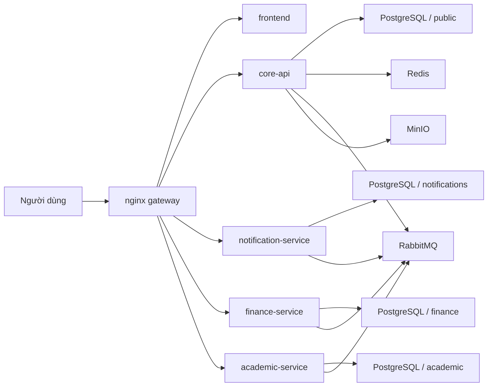

# Kiến trúc CampusCore v3

CampusCore hiện được tổ chức theo hướng **microservices portfolio v3**. Mục tiêu của pha này không phải tách mọi domain cùng lúc, mà là tạo ra boundary rõ ràng, deployable thật, release pipeline thật và public edge thống nhất.

## 1. Thành phần chính

- `core-api`
- `notification-service`
- `finance-service`
- `academic-service`
- `frontend`
- `nginx gateway`

Shared infra:

- PostgreSQL
- Redis
- RabbitMQ
- MinIO

## 2. Runtime topology

## 3. Ownership theo service

### `core-api`

Owner của:

- auth, session, cookie, CSRF contract
- users, roles, permissions
- students, lecturers
- announcements
- analytics
- internal finance-context API
- public `/health`

Không còn owner public của:

- notifications
- finance domain
- public academic APIs

### `notification-service`

Owner của:

- notification inbox
- unread count
- REST notifications API
- websocket `/notifications`
- realtime fan-out từ event queue

Không join trực tiếp sang schema `public`. `userId` được lưu như opaque reference.

### `finance-service`

Owner của:

- invoices
- invoice items
- payments
- scholarships
- student scholarships
- finance exports
- finance events

Read-through context hiện tại vẫn đi từ `finance-service` sang `core-api` qua internal HTTP và `X-Service-Token`.

### `academic-service`

Owner của public academic APIs:

- faculties
- departments
- academic years
- semesters
- courses
- curricula
- classrooms
- sections
- enrollments
- grades
- waitlist
- attendance
- schedules

`academic-service` dùng schema riêng `academic` và snapshot one-time cho:

- `User`
- `Student`
- `Lecturer`

Điều này cho phép service tự join dữ liệu học vụ trong schema của chính nó, nhưng chưa cần đồng bộ runtime phức tạp ở v3.

### `frontend`

Frontend không đổi public path. Sự thay đổi nằm ở owner phía sau gateway.

## 4. Public routing

`nginx` route theo boundary sau:

- `/` và route web -> `frontend`
- `/health` -> `core-api`
- `/api/docs` -> `core-api`
- `/api/v1/auth/*`, `/api/v1/users/*`, `/api/v1/students/*`, `/api/v1/lecturers/*`, `/api/v1/announcements/*`, `/api/v1/analytics/*` -> `core-api`
- `/api/v1/notifications/*` và `/socket.io/*` -> `notification-service`
- `/api/v1/finance/*` -> `finance-service`
- public academic paths như `/api/v1/semesters/*`, `/api/v1/courses/*`, `/api/v1/sections/*`, `/api/v1/enrollments/*`, `/api/v1/grades/*`, `/api/v1/attendance/*` -> `academic-service`

Public edge chặn:

- `/api/v1/health/liveness`
- `/api/v1/health/readiness`
- `/internal/*`

## 5. Dữ liệu và schema

CampusCore dùng **per-service schema trong cùng một PostgreSQL cluster**:

- `core-api` -> `public`
- `notification-service` -> `notifications`
- `finance-service` -> `finance`
- `academic-service` -> `academic`

Nguyên tắc:

- không foreign key chéo service
- không join runtime trực tiếp sang schema khác
- ID ngoài service được lưu dạng opaque reference

## 6. Event flow

Envelope sự kiện chuẩn:

- `type`
- `source`
- `occurredAt`
- `payload`

Event chính hiện tại:

- `core-api`
  - `announcement.created`
  - `notification.user.created`
  - `notification.role.created`
- `finance-service`
  - `invoice.created`
  - `invoice.status.changed`
  - `payment.completed`

`notification-service` consume các event cần thiết để tạo inbox hoặc phát realtime billing updates.

## 7. Health model

### Public

- `GET /health` là public liveness tối giản của `core-api`

### Internal

- `GET /api/v1/health/liveness`
- `GET /api/v1/health/readiness`

Readiness không public qua gateway và yêu cầu `X-Health-Key` ở production-like path.

## 8. Điều v3 chưa làm

V3 vẫn có chủ đích giữ một số phần ở `core-api`:

- `students`
- `lecturers`
- auth source of truth
- analytics
- finance-context

Pha tiếp theo chỉ nên cân nhắc khi boundary nội bộ đủ cứng. Nếu tiếp tục tách học vụ sâu hơn, hướng hợp lý là thu nhỏ `core-api` thêm thay vì tạo ownership chồng chéo.
