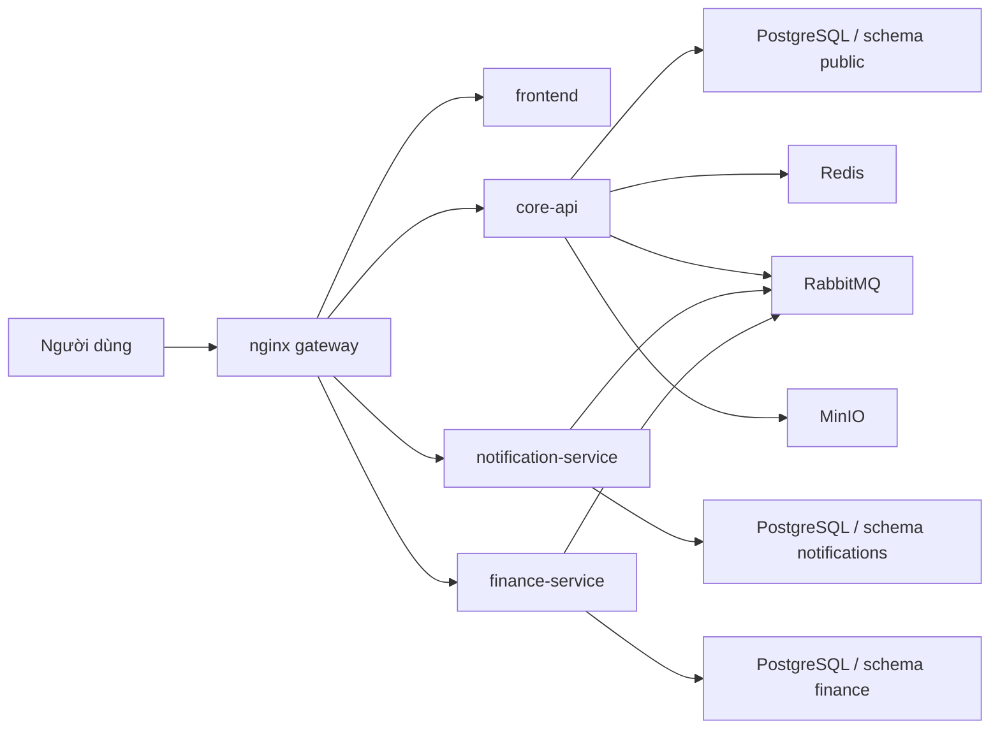

# Kiến trúc CampusCore v2

CampusCore hiện được tổ chức theo hướng **microservices portfolio v2**. Kiến trúc này chưa tách toàn bộ domain thành nhiều service độc lập, nhưng đã có ranh giới triển khai thật giữa:

- `core-api`
- `notification-service`
- `finance-service`
- `frontend`
- `nginx gateway`

## 1. Mục tiêu kiến trúc

Thiết kế hiện tại ưu tiên:

- tách ownership theo domain trước khi tách toàn bộ tổ chức dữ liệu
- giữ public contract ổn định cho frontend
- dùng event-driven integration ở những đường phù hợp
- giữ vận hành thực tế bằng Docker Compose, release image và public gateway

## 2. Service boundary

### `core-api`

`core-api` là NestJS 11 service trung tâm, giữ vai trò system of record cho:

- auth, session, cookie và CSRF contract
- users, roles, permissions
- students, semesters, enrollments, sections
- grades, schedules
- announcements
- public health `GET /health`
- internal readiness `GET /api/v1/health/readiness`
- internal finance context API cho `finance-service`

`core-api` không còn là owner của:

- notification inbox
- invoices, payments, scholarships

### `notification-service`

`notification-service` là NestJS 11 service độc lập, sở hữu:

- notification inbox data
- unread count
- REST API `GET /api/v1/notifications/*`
- websocket namespace `/notifications`
- realtime broadcast và inbox persistence từ event queue
- health probes riêng

Service này không truy cập trực tiếp bảng user của `core-api`. `userId` được lưu như một opaque reference.

### `finance-service`

`finance-service` là NestJS 11 service độc lập, sở hữu:

- invoices
- invoice items
- payments
- scholarships
- student scholarships
- finance exports
- finance event publishing
- finance health probes

`finance-service` không join trực tiếp sang schema `public` của `core-api`. Khi cần đọc bối cảnh học vụ, service này gọi internal HTTP endpoint của `core-api`.

### `frontend`

`frontend` là Next.js 15 application cho toàn bộ trải nghiệm người dùng:

- student flows
- lecturer flows
- admin flows

Public path của frontend được giữ ổn định khi backend tách service.

### `nginx gateway`

`nginx` là public edge duy nhất:

- terminate public HTTP entrypoint
- route request đến đúng service
- chặn internal path không được public
- áp rate limiting và hardening ở mép ngoài

## 3. Runtime topology

## 4. Public routing

`nginx` route theo boundary sau:

- `/` và route web đi tới `frontend`
- `/api/docs`, `/api/v1/auth/*`, route học vụ còn lại đi tới `core-api`
- `/api/v1/notifications/*` đi tới `notification-service`
- `/socket.io/*` đi tới `notification-service`
- `/api/v1/finance/*` đi tới `finance-service`
- `/health` đi tới public liveness của `core-api`

Các path bị chặn khỏi public edge:

- `/api/v1/health`
- `/api/v1/health/liveness`
- `/api/v1/health/readiness`
- `/internal/*`

## 5. Data ownership

CampusCore dùng **per-service schema trong cùng cụm PostgreSQL**:

- `core-api` dùng `schema=public`
- `notification-service` dùng `schema=notifications`
- `finance-service` dùng `schema=finance`

Nguyên tắc:

- không foreign key chéo service
- không join runtime trực tiếp sang schema khác
- reference ngoài service được giữ dưới dạng opaque ID

### Snapshot strategy cho finance

Để giảm coupling khi hiển thị invoice, `finance-service` lưu snapshot hiển thị trên invoice:

- `studentDisplayName`
- `studentEmail`
- `studentCode`
- `semesterName`

Snapshot này được lấy từ internal finance context API tại thời điểm tạo invoice.

## 6. Internal finance context API

`core-api` cung cấp internal-only endpoint cho `finance-service`:

- `GET /internal/v1/finance-context/students/:studentId`
- `GET /internal/v1/finance-context/semesters/:semesterId`
- `GET /internal/v1/finance-context/semesters/:semesterId/billable-students`

Đặc điểm:

- không public qua `nginx`
- dùng header `X-Service-Token`
- token được chia sẻ qua env `INTERNAL_SERVICE_TOKEN`

Mục đích:

- xác thực reference từ finance
- lấy danh sách billable student khi generate invoice theo semester
- lấy snapshot học vụ để đóng băng vào invoice

## 7. Event contract

Envelope chuẩn:

- `type`
- `source`
- `occurredAt`
- `payload`

### Event từ `core-api`

- `announcement.created`
- `notification.user.created`
- `notification.role.created`

### Event từ `finance-service`

- `invoice.created`
- `invoice.status.changed`
- `payment.completed`

### Hành vi của `notification-service`

- consume event để tạo inbox hoặc phát realtime
- billing notifications có thể được phát từ event `invoice.created` và `payment.completed`
- route websocket public vẫn giữ namespace `/notifications`

## 8. Health model

### Public

- `GET /health` là public liveness tối giản của `core-api`

### Internal

- `GET /api/v1/health/liveness` cho liveness nội bộ từng service
- `GET /api/v1/health/readiness` cho readiness nội bộ từng service

Readiness nội bộ không được public qua gateway.

## 9. Kiến trúc v2 chưa làm gì

Microservices v2 vẫn có các giới hạn có chủ đích:

- chưa tách `academic-service`
- chưa tách `auth-service`
- chưa có Kubernetes/Helm là tầng triển khai chính
- chưa dùng outbox pattern đầy đủ cho mọi domain
- vẫn dùng shared PostgreSQL cluster, mới tách theo schema chứ chưa tách cluster

V2 tập trung vào việc có **service boundary thật, release image thật, runtime gateway thật và ownership theo domain rõ ràng**.
