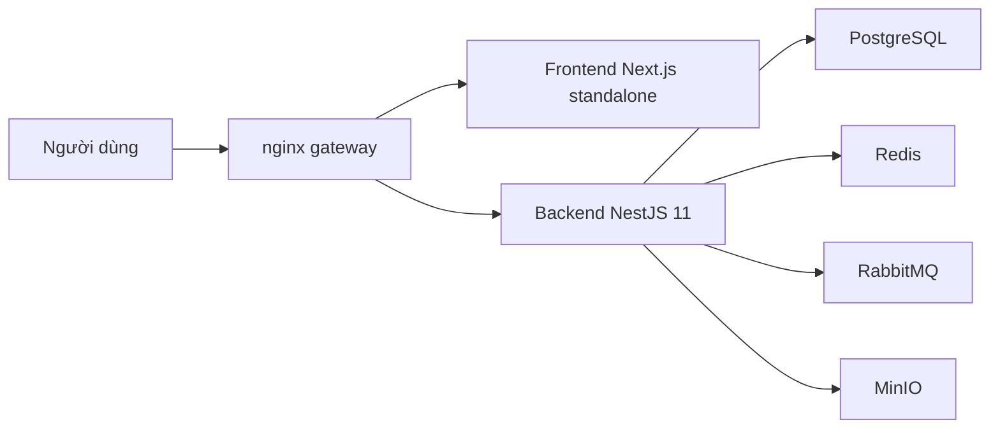

# Kiến Trúc

CampusCore được triển khai như **một backend NestJS 11 deployable duy nhất**, nhưng được verify theo phong cách **multi-service stack**. Mục tiêu của cách làm này là giữ vận hành gọn, trong khi vẫn kiểm chứng runtime gần với môi trường sản phẩm.

## Sơ Đồ Runtime

## Thành Phần Chính

- Frontend: Next.js 15, chạy production-like bằng standalone runtime trong Docker
- Backend: NestJS 11, Prisma, JWT, Socket.IO, Swagger, CSRF cho browser flow
- Data plane: PostgreSQL
- Cache/session support: Redis
- Queue/realtime support: RabbitMQ
- Object storage contract: MinIO
- Public edge: nginx

## Public Contract

| URL | Mục đích |
| --- | --- |
| `http://localhost` | Điểm vào công khai |
| `http://localhost/login` | Trang đăng nhập |
| `http://localhost/health` | Liveness công khai, tối giản |
| `http://localhost/api/docs` | Swagger UI |
| `http://localhost/api/v1/health/readiness` | Readiness nội bộ |

## Auth Contract

Browser auth dùng cookie:

- `cc_access_token`
- `cc_refresh_token`
- `cc_csrf`

Mọi request mutating từ browser phải gửi `X-CSRF-Token`. Legacy clients vẫn có thể dùng JSON token/Bearer trong giai đoạn chuyển tiếp.

## Health Contract

- `GET /health`: public liveness, chỉ trả thông tin tối thiểu
- `GET /api/v1/health/readiness`: readiness chi tiết cho nội bộ và ops
- `GET /api/v1/health`: alias tạm thời để giữ tương thích

Readiness phản ánh trạng thái `database`, `redis`, `rabbitmq` theo `up`, `down`, `not_configured`.

## Production-Like Runtime

Frontend production-like phải chạy bằng standalone runtime. Nginx là public edge, không truy cập trực tiếp backend hoặc frontend container từ bên ngoài stack.

Backend vẫn là một deployable duy nhất, nhưng các kiểm thử runtime được thiết kế để nhìn hệ thống như một stack nhiều service thật:

- compose contract
- backend integration
- image smoke
- edge E2E

## Những Gì Không Làm Trong Đợt Này

- Không tách backend thành nhiều microservice thật
- Không mở thêm flow upload mới
- Không đổi API business ngoài auth/health/runtime contract đã chốt

## Tài Liệu Liên Quan

- [Vận hành](./OPERATIONS.md)
- [Bảo mật](./SECURITY.md)
- [Phát hành](./RELEASE.md)
