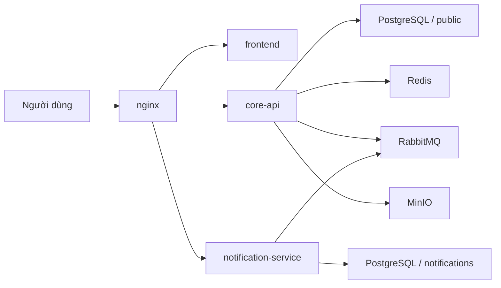

# Kiến trúc

CampusCore hiện được tổ chức theo hướng **microservices portfolio v1**. Hệ thống chưa tách toàn bộ domain thành nhiều service, nhưng đã có ranh giới triển khai thật giữa `core-api` và `notification-service`.

## Service boundary

### core-api

`core-api` là NestJS 11 service chính, sở hữu:

- auth, session, cookie và CSRF contract
- users, roles, permissions
- announcements
- enrollments, grades, schedules, finance, analytics
- public liveness `GET /health`
- internal readiness `GET /api/v1/health/readiness`
- RabbitMQ publisher cho các event nghiệp vụ

### notification-service

`notification-service` là NestJS 11 service độc lập, sở hữu:

- notification inbox data
- REST API `GET /api/v1/notifications/*`
- websocket namespace `/notifications`
- RabbitMQ consumer cho realtime delivery
- internal health riêng
- Prisma schema `notifications` trong cùng cụm PostgreSQL

## Runtime topology

## Public routing

`nginx` là public edge duy nhất:

- `/` và route web đi tới `frontend`
- `/api/docs`, `/api/v1/auth/*`, route học vụ còn lại đi tới `core-api`
- `/api/v1/notifications/*` đi tới `notification-service`
- `/socket.io/*` đi tới `notification-service`
- `/health` đi tới public liveness của `core-api`
- readiness path bị chặn ở public edge

## Data ownership

CampusCore dùng **per-service schema** trong cùng một cụm PostgreSQL:

- `core-api` dùng `schema=public`
- `notification-service` dùng `schema=notifications`

Notification record chỉ lưu `userId` dạng opaque string và metadata cần thiết. Service này không dùng foreign key sang bảng user của `core-api`.

## Event contract v1

`core-api` phát event qua RabbitMQ bằng envelope thống nhất:

- `type`
- `source`
- `occurredAt`
- `payload`

Event hiện được chốt cho v1:

- `announcement.created`
- `notification.user.created`
- `notification.role.created`

Semantics hiện tại:

- `announcement.created`: chỉ broadcast realtime, không tự persist inbox
- `notification.user.created`: persist một record rồi emit vào `user:{id}`
- `notification.role.created`: persist khi có `userIds`, nếu không thì chỉ emit vào `role:{role}`

## Điều chưa làm trong v1

- chưa tách `auth-service`
- chưa tách database cluster riêng cho từng service
- chưa đưa orchestration lên Kubernetes
- chưa split toàn bộ domain học vụ thành nhiều deployable

V1 tập trung vào ranh giới service thật, pipeline thật, release thật và verification sát runtime thật.
