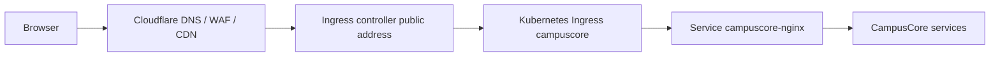

# Cloudflare Handoff

Tài liệu này mô tả cách đặt Cloudflare phía trước CampusCore khi bạn đã có:

- một domain đang quản lý trong Cloudflare,
- một Kubernetes cluster thật,
- một ingress controller trong cluster,
- secret manager hoặc private secret workflow của riêng bạn,
- `cert-manager` nếu muốn cấp TLS tự động,
- `External Secrets` nếu muốn sync secret runtime từ secret manager.

Repo public không commit hostname thật, token thật, TLS private key, hay secret manager path thật. Các giá trị đó đi vào private overlay copy từ `k8s/templates/private-operator/*`.

## Kiến trúc khuyến nghị

Đường production-like mặc định:



Cloudflare chỉ đứng ở lớp DNS/WAF/CDN trước ingress. Cloudflare không thay runtime cluster, không thay `campuscore-nginx`, và không thay service boundary hiện tại.

Chế độ TLS nên dùng là **Full (strict)**: browser đến Cloudflare được mã hóa, Cloudflare đến origin cũng được mã hóa, và origin phải có certificate hợp lệ cho hostname thật. Không dùng **Flexible** cho CampusCore vì browser auth/cookie/session dễ gặp redirect loop hoặc mixed security model.

## Khi nào dùng Cloudflare Tunnel

Cloudflare Tunnel là lựa chọn tốt nếu cluster không có public LoadBalancer hoặc bạn cố ý không mở inbound public traffic. Khi đó bạn chạy `cloudflared` như một deployment riêng trong cluster và route hostname Cloudflare vào service nội bộ.

Với CampusCore, Tunnel chưa phải đường mặc định của repo public vì handoff hiện tại đang chuẩn hóa theo Ingress cloud-agnostic. Nếu chọn Tunnel, hãy làm trong private overlay riêng và vẫn giữ `campuscore-nginx` là service edge nội bộ.

## Local tunnel nhanh cho Docker Desktop

Khi bạn chưa có IP public hoặc cloud Kubernetes thật, có thể expose Docker Desktop Kubernetes local qua Cloudflare Tunnel. Repo đã có helper:

```bash
node scripts/run-cloudflare-tunnel-local.mjs
```

Script này sẽ:

1. gọi `node scripts/run-k8s-local-edge.mjs` để đảm bảo app đang mở tại `http://127.0.0.1:8080`;
2. nếu máy có `cloudflared` native thì dùng native connector;
3. nếu chưa có `cloudflared`, dùng Docker image `cloudflare/cloudflared:latest`;
4. nếu chưa set `CLOUDFLARE_TUNNEL_TOKEN`, tạo quick tunnel tạm thời dạng `https://*.trycloudflare.com`;
5. nếu đã set `CLOUDFLARE_TUNNEL_TOKEN`, chạy named tunnel để bạn gắn hostname thật trong Cloudflare.

Stop Docker connector nếu cần:

```bash
node scripts/stop-cloudflare-tunnel-local.mjs
```

### Quick tunnel không cần domain

Dùng để kiểm demo ngay:

```bash
node scripts/run-cloudflare-tunnel-local.mjs
```

Chờ terminal in ra URL dạng:

```text
https://something.trycloudflare.com
```

Rồi mở:

- `https://something.trycloudflare.com/health`
- `https://something.trycloudflare.com/login`
- `https://something.trycloudflare.com/api/docs`

Quick tunnel chỉ nên dùng demo/test. URL tạm sẽ đổi khi tunnel dừng.

### Named tunnel với domain thật

Để dùng hostname như `campuscore.tienson.io.vn`, làm trong Cloudflare dashboard:

1. Vào **Zero Trust**.
2. Vào **Networks** -> **Tunnels**.
3. Chọn **Create a tunnel**.
4. Chọn connector **Cloudflared**.
5. Đặt tên, ví dụ `campuscore-local`.
6. Chọn environment **Docker**.
7. Copy **token value**. Không paste token vào chat hoặc commit vào repo.
8. Trong PowerShell tại repo:

```powershell
$env:CLOUDFLARE_TUNNEL_TOKEN = "paste-token-vua-copy-o-day"
node scripts/run-cloudflare-tunnel-local.mjs
```

9. Ở bước **Public Hostname** trong Cloudflare:

| Field | Giá trị khuyến nghị |
| --- | --- |
| Subdomain | `campuscore` |
| Domain | `tienson.io.vn` |
| Type | `HTTP` |
| URL | `host.docker.internal:8080` |

Vì script mặc định chạy connector bằng Docker, container phải đi qua `host.docker.internal` để gọi local edge trên máy Windows. Nếu bạn cài `cloudflared` native và chạy với `CLOUDFLARE_TUNNEL_CONNECTOR=native`, Service URL trong Cloudflare đổi thành `http://127.0.0.1:8080`.

Sau đó verify:

```bash
curl -i https://campuscore.tienson.io.vn/health
curl -i https://campuscore.tienson.io.vn/login
curl -i https://campuscore.tienson.io.vn/api/docs
curl -i https://campuscore.tienson.io.vn/api/v1/internal/auth-context/users/test
curl -i https://campuscore.tienson.io.vn/api/v1/health/readiness
```

Expected:

- `/health` trả `200`
- `/login` trả `200`
- `/api/docs` trả `200` khi local overlay đang bật Swagger
- `/api/v1/internal/*` trả `403`
- `/api/v1/health/readiness` trả `403`

## Các file cần điền trong private overlay

Copy một template ra private repo hoặc private folder ngoài repo public:

```bash
cp -R k8s/templates/private-operator/staging ../campuscore-private-k8s/staging
cp -R k8s/templates/private-operator/prod ../campuscore-private-k8s/prod
```

Sau đó điền các file sau:

| Giá trị thật | File cần sửa |
| --- | --- |
| Hostname, ví dụ `campuscore.example.com` | `patch-ingress.yaml`, `patch-certificate.yaml`, `patch-configmap.yaml` |
| TLS secret name | `patch-ingress.yaml`, `patch-certificate.yaml` |
| Ingress class nếu cluster yêu cầu | `patch-ingress.yaml` |
| Ingress annotations của controller/DNS | `patch-ingress.yaml` |
| `ClusterSecretStore` thật | `patch-external-secret.yaml` |
| Remote secret key/path thật | `patch-external-secret.yaml` |
| `ClusterIssuer` thật | `patch-certificate.yaml` |
| Replicas/resources/rolling update theo capacity | `patch-runtime-overrides.yaml` |

## Bước triển khai với Cloudflare DNS + Ingress

1. Chuẩn bị cluster:

```bash
kubectl get nodes
kubectl get ingressclass
kubectl get svc -A
```

2. Cài hoặc xác nhận ingress controller đã có public address:

```bash
kubectl get svc -A | Select-String -Pattern "LoadBalancer|ingress"
```

Trên Linux/macOS thay `Select-String` bằng `grep` nếu cần. Bạn cần một IP hoặc hostname public để Cloudflare trỏ tới.

3. Copy private operator template phù hợp rồi sửa:

```bash
kubectl kustomize ../campuscore-private-k8s/staging
kubectl kustomize ../campuscore-private-k8s/staging/bootstrap
```

Với prod:

```bash
kubectl kustomize ../campuscore-private-k8s/prod
kubectl kustomize ../campuscore-private-k8s/prod/bootstrap
```

4. Điền hostname thật trong private overlay:

- `patch-configmap.yaml`: `FRONTEND_URL=https://<your-hostname>`
- `patch-ingress.yaml`: `spec.rules[].host`, `spec.tls[].hosts[]`
- `patch-certificate.yaml`: `spec.dnsNames[]`

5. Tạo DNS record trong Cloudflare:

- dùng `A`/`AAAA` nếu ingress controller có IP public,
- dùng `CNAME` nếu ingress controller có DNS hostname,
- bật proxy Cloudflare cho web traffic sau khi origin/TLS đã sẵn sàng,
- giữ mail/MX/non-HTTP records ở DNS-only nếu có.

6. Cấu hình Cloudflare SSL/TLS:

- chọn **Full (strict)**,
- origin phải phục vụ HTTPS trên `443`,
- certificate origin phải còn hạn và khớp hostname.

7. Nếu dùng cert-manager DNS-01 với Cloudflare, tạo Cloudflare API Token có quyền tối thiểu:

- `Zone - DNS - Edit`
- `Zone - Zone - Read`

Token này không đi vào repo. Lưu nó vào secret manager hoặc Kubernetes Secret của cert-manager namespace theo chính sách của cluster.

Ví dụ `ClusterIssuer` private:

```yaml
apiVersion: cert-manager.io/v1
kind: ClusterIssuer
metadata:
  name: letsencrypt-cloudflare-prod
spec:
  acme:
    email: admin@example.com
    server: https://acme-v02.api.letsencrypt.org/directory
    privateKeySecretRef:
      name: letsencrypt-cloudflare-prod-account-key
    solvers:
      - dns01:
          cloudflare:
            apiTokenSecretRef:
              name: cloudflare-api-token-secret
              key: api-token
```

Trong private template, `patch-certificate.yaml` sẽ trỏ tới `ClusterIssuer` này.

8. Điền secret runtime qua `ExternalSecret`:

`patch-external-secret.yaml` phải bind đúng:

- `ClusterSecretStore`
- remote secret key/path thật
- các property bắt buộc: `POSTGRES_PASSWORD`, `JWT_SECRET`, `JWT_REFRESH_SECRET`, `HEALTH_READINESS_KEY`, `INTERNAL_SERVICE_TOKEN`, `RABBITMQ_PASSWORD`, `MINIO_USER`, `MINIO_PASSWORD`

SMTP có thể để trống chỉ khi môi trường đó không gửi email thật.

9. Apply runtime trước:

```bash
kubectl apply -k ../campuscore-private-k8s/staging
kubectl -n campuscore-staging get externalsecret,certificate,ingress
kubectl -n campuscore-staging rollout status deploy/campuscore-nginx
kubectl -n campuscore-staging get pods
```

10. Khi secret/TLS/runtime đã sẵn sàng, chạy bootstrap:

```bash
kubectl apply -k ../campuscore-private-k8s/staging/bootstrap
kubectl -n campuscore-staging get jobs
```

11. Verify public edge:

```bash
curl -i https://<your-hostname>/health
curl -i https://<your-hostname>/login
curl -i https://<your-hostname>/api/docs
curl -i https://<your-hostname>/api/v1/internal/auth-context/users/test
curl -i https://<your-hostname>/api/v1/health/readiness
```

Expected:

- `/health` trả `200`
- `/login` trả `200`
- `/api/docs` chỉ mở nếu môi trường cho phép Swagger
- `/api/v1/internal/*` trả `403`
- `/api/v1/health/readiness` trả `403`

12. Sau khi edge ổn, bật thêm Cloudflare WAF/rate limiting theo nhu cầu. Không cache các route auth/session/API mutating. Nếu muốn cache frontend static assets, chỉ làm theo rule rõ ràng cho static paths.

## Checklist nhanh khi bạn có domain

1. Domain đã add vào Cloudflare và nameserver đã trỏ đúng.
2. Cluster có ingress controller và public address.
3. Copy `k8s/templates/private-operator/prod` ra private overlay.
4. Điền hostname thật, ingress class/annotations thật, TLS secret thật.
5. Tạo Cloudflare DNS record tới ingress address.
6. Cấu hình Cloudflare SSL/TLS Full (strict).
7. Tạo Cloudflare API Token cho cert-manager nếu dùng DNS-01.
8. Tạo/kiểm `ClusterSecretStore` và remote secret path.
9. Render private overlay và bootstrap.
10. Apply runtime, chờ ExternalSecret/Certificate/Ingress/rollout.
11. Apply bootstrap jobs.
12. Verify health/login/docs/internal deny/readiness deny.

## Troubleshooting

### Cloudflare báo 526

Thường là origin certificate không hợp lệ với Full (strict). Kiểm tra:

- `Certificate` trong namespace đã `Ready=True` chưa,
- TLS secret name trong `Ingress` có khớp `Certificate.spec.secretName` không,
- DNS hostname có khớp `Certificate.spec.dnsNames[]` không,
- ingress controller có terminate TLS bằng đúng secret không.

### Browser vào được nhưng login/session lỗi

Kiểm tra `FRONTEND_URL`, `COOKIE_SECURE`, TLS mode, và domain cookie. Với staging/prod qua HTTPS, `COOKIE_SECURE` phải là `true`.

### Cert-manager không tạo được certificate

Kiểm tra Cloudflare token có đủ `Zone - DNS - Edit` và `Zone - Zone - Read`, token đang nằm đúng secret namespace, và `ClusterIssuer` đang trỏ đúng `apiTokenSecretRef`.

### Docker Desktop local khác gì Cloudflare production

Local path vẫn là:

```bash
node scripts/run-k8s-local-deploy.mjs
node scripts/run-k8s-local-edge.mjs
```

Local dùng `ClusterIP + port-forward` ở `127.0.0.1:8080`. Cloudflare production dùng DNS/proxy/TLS trước Kubernetes Ingress. Hai đường này dùng chung `k8s/base` nhưng khác overlay.

## Nguồn chính thức

- Cloudflare DNS records: https://developers.cloudflare.com/dns/manage-dns-records/
- Cloudflare Full (strict): https://developers.cloudflare.com/ssl/origin-configuration/ssl-modes/full-strict/
- cert-manager Cloudflare DNS-01: https://cert-manager.io/docs/configuration/acme/dns01/cloudflare/
- Cloudflare Tunnel on Kubernetes: https://developers.cloudflare.com/tunnel/deployment-guides/kubernetes/
